# Phase 13.1: Overall Execution Flow - High-Level Architecture

**Date:** 2025-11-07
**Binary:** Akira Ransomware (def3fe8d07d5370ac6e105b1a7872c77e193b4b39a6e1cc9cfc815a36e909904)
**Visualization Type:** Mermaid Flowchart + ASCII Diagram

---

## 1. High-Level Execution Flow (Mermaid)

```mermaid
flowchart TD
    Start([Akira.exe Execution]) --> CRT[CRT Initialization<br/>startup_main_wrapper]
    CRT --> Main[main Function<br/>0x14004d2b0]

    Main --> Phase1[Phase 1: Logging<br/>Create Log-DD-MM-YYYY-HH-MM-SS]
    Phase1 --> Phase2[Phase 2: Command-Line Parsing<br/>GetCommandLineW + Parse Args]
    Phase2 --> Phase3[Phase 3: Argument Extraction<br/>--encryption_path<br/>--share_file<br/>--encryption_percent]

    Phase3 --> Phase4[Phase 4: Subsystem Init]
    Phase4 --> Crypto[Init Crypto Engine<br/>RSA-2048 + ChaCha20]
    Phase4 --> Threads[Init Thread Pool<br/>ASIO Dual Pools]
    Phase4 --> Blacklist1[Init Directory Blacklist<br/>11 exclusions]
    Phase4 --> Blacklist2[Init Extension Blacklist<br/>5 exclusions]

    Crypto --> Phase5
    Threads --> Phase5
    Blacklist1 --> Phase5
    Blacklist2 --> Phase5

    Phase5[Phase 5: Drive Enumeration] --> DriveLoop{For Each Drive}

    DriveLoop -->|C:\| EnqueueC[Enqueue Encryption Task]
    DriveLoop -->|D:\| EnqueueD[Enqueue Encryption Task]
    DriveLoop -->|Network| EnqueueN[Enqueue Encryption Task]

    EnqueueC --> Workers
    EnqueueD --> Workers
    EnqueueN --> Workers

    Workers[Phase 6: Worker Threads<br/>8-16 threads] --> FolderProc[Folder Processor<br/>Recursive Traversal]

    FolderProc --> FilterDir{Directory<br/>Blacklisted?}
    FilterDir -->|Yes| Skip1[Skip Directory]
    FilterDir -->|No| FileEnum[Enumerate Files]

    FileEnum --> FilterExt{Extension<br/>Blacklisted?}
    FilterExt -->|Yes| Skip2[Skip File]
    FilterExt -->|No| StateMachine[File Encryption<br/>State Machine<br/>21 States]

    StateMachine --> OpenFile[State 7: Open File]
    OpenFile --> ReadEncrypt[States 8-b: Read + Encrypt<br/>ChaCha20 Custom Variant]
    ReadEncrypt --> WriteFooter[State c: Write Footer<br/>512 bytes RSA-encrypted]
    WriteFooter --> RenameFile[State e: Rename .akira]
    RenameFile --> DeployNote[Deploy Ransom Note<br/>akira_readme.txt]

    DeployNote --> NextFile{More Files?}
    NextFile -->|Yes| FileEnum
    NextFile -->|No| NextDir{More Dirs?}
    NextDir -->|Yes| FolderProc
    NextDir -->|No| Complete

    Skip1 --> NextDir
    Skip2 --> NextFile

    Workers --> WaitAll[Wait All Threads Complete]
    WaitAll --> Phase7[Phase 7: Post-Encryption]

    Phase7 --> ShadowDel{-dellog flag?}
    ShadowDel -->|Yes| PowerShell[Execute PowerShell<br/>Delete Shadow Copies]
    ShadowDel -->|No| Cleanup
    PowerShell --> Cleanup[Cleanup & Exit]

    Complete --> WaitAll
    Cleanup --> End([Process Termination])

    style Start fill:#ff6b6b
    style Main fill:#4ecdc4
    style Crypto fill:#ffe66d
    style Threads fill:#ffe66d
    style StateMachine fill:#95e1d3
    style PowerShell fill:#f38181
    style End fill:#ff6b6b
```



---

## 2. ASCII Flow Diagram (Detailed)

```
┌─────────────────────────────────────────────────────────────────────────────┐
│                          AKIRA RANSOMWARE EXECUTION FLOW                    │
└─────────────────────────────────────────────────────────────────────────────┘

                                  ┌───────────┐
                                  │ Akira.exe │
                                  │  Starts   │
                                  └─────┬─────┘
                                        │
                         ┌──────────────▼──────────────┐
                         │  CRT Initialization          │
                         │  startup_main_wrapper        │
                         │  @ 0x14008dbc4               │
                         └──────────────┬──────────────┘
                                        │
         ╔══════════════════════════════▼══════════════════════════════╗
         ║                       MAIN FUNCTION                         ║
         ║                      @ 0x14004d2b0                          ║
         ║                      (7 Phases Total)                       ║
         ╚══════════════════════════════════════════════════════════════╝

┌────────────────────────────────────────────────────────────────────────────┐
│ PHASE 1: LOGGING INITIALIZATION (~0.001s)                                 │
├────────────────────────────────────────────────────────────────────────────┤
│  ├─→ Get current time (time64)                                            │
│  ├─→ Format log filename: "Log-DD-MM-YYYY-HH-MM-SS"                       │
│  └─→ Initialize logging subsystem                                         │
└────────────────────────────────────────────────────────────────────────────┘
                                        │
┌────────────────────────────────────────▼───────────────────────────────────┐
│ PHASE 2: COMMAND-LINE PARSING (~0.01s)                                    │
├────────────────────────────────────────────────────────────────────────────┤
│  ├─→ GetCommandLineW()                                                    │
│  ├─→ CommandLineToArgvW() → argc, argv[]                                 │
│  └─→ Build STL argument collection                                        │
└────────────────────────────────────────────────────────────────────────────┘
                                        │
┌────────────────────────────────────────▼───────────────────────────────────┐
│ PHASE 3: ARGUMENT EXTRACTION (~0.005s)                                    │
├────────────────────────────────────────────────────────────────────────────┤
│  ├─→ Extract --encryption_path (target directory)                         │
│  ├─→ Extract --share_file (network share list)                            │
│  ├─→ Extract --encryption_percent (1-100, default 100)                    │
│  └─→ Extract -dellog flag (shadow copy deletion)                          │
└────────────────────────────────────────────────────────────────────────────┘
                                        │
         ╔══════════════════════════════▼══════════════════════════════╗
         ║          PHASE 4: SUBSYSTEM INITIALIZATION (~0.1s)          ║
         ╚══════════════════════════════════════════════════════════════╝
                                        │
              ┌─────────────┬───────────┴───────────┬─────────────┐
              │             │                       │             │
              ▼             ▼                       ▼             ▼
     ┌────────────┐  ┌────────────┐        ┌────────────┐ ┌────────────┐
     │Init Crypto │  │Init Thread │        │  Init Dir  │ │  Init Ext  │
     │   Engine   │  │    Pool    │        │ Blacklist  │ │ Blacklist  │
     │            │  │            │        │            │ │            │
     │  RSA-2048  │  │ ASIO Pools │        │ 11 entries │ │  5 entries │
     │  ChaCha20  │  │ 8-16 thds  │        │            │ │            │
     └────────────┘  └────────────┘        └────────────┘ └────────────┘
         0x140084210    0x14007b6d0           0x1400018a0    0x140001ac0
              │             │                       │             │
              └─────────────┴───────────┬───────────┴─────────────┘
                                        │
┌────────────────────────────────────────▼───────────────────────────────────┐
│ PHASE 5: DRIVE ENUMERATION (~0.05s)                                       │
├────────────────────────────────────────────────────────────────────────────┤
│  ├─→ GetLogicalDriveStringsW() → "C:\", "D:\", "E:\"...                  │
│  ├─→ GetDriveTypeW() → Classify: FIXED, REMOVABLE, REMOTE                │
│  ├─→ Create drive_entry_t structure (40 bytes each)                       │
│  └─→ Build std::vector<drive_entry_t>                                     │
└────────────────────────────────────────────────────────────────────────────┘
                                        │
         ╔══════════════════════════════▼══════════════════════════════╗
         ║      PHASE 6: ENCRYPTION CAMPAIGN (10 min - 2 hours)       ║
         ╚══════════════════════════════════════════════════════════════╝
                                        │
                        ┌───────────────┴───────────────┐
                        │  For Each Drive (parallel)    │
                        └───────────────┬───────────────┘
                                        │
              ┌─────────────────────────┼─────────────────────────┐
              │                         │                         │
              ▼                         ▼                         ▼
      ┌──────────────┐          ┌──────────────┐        ┌──────────────┐
      │ Drive C:\    │          │ Drive D:\    │        │ Network \\   │
      │ (FIXED)      │          │ (REMOVABLE)  │        │ (REMOTE)     │
      └──────┬───────┘          └──────┬───────┘        └──────┬───────┘
             │                         │                       │
             └─────────────────────────┼───────────────────────┘
                                       │
                             ┌─────────▼────────┐
                             │ Enqueue Task to  │
                             │  Producer Queue  │
                             │  @ 0x14007b850   │
                             └─────────┬────────┘
                                       │
         ┏━━━━━━━━━━━━━━━━━━━━━━━━━━━━━▼━━━━━━━━━━━━━━━━━━━━━━━━━━━━━┓
         ┃            WORKER THREAD POOL (8-16 threads)              ┃
         ┃                                                            ┃
         ┃  ┌────────┐ ┌────────┐ ┌────────┐ ┌────────┐            ┃
         ┃  │Thread 1│ │Thread 2│ │Thread 3│ │  ...   │            ┃
         ┃  └───┬────┘ └───┬────┘ └───┬────┘ └───┬────┘            ┃
         ┃      │          │          │          │                  ┃
         ┃      └──────────┴──────────┴──────────┘                  ┃
         ┃                  │                                        ┃
         ┃         ┌────────▼─────────┐                             ┃
         ┃         │ Folder Processor │                             ┃
         ┃         │   @ 0x1400bf190  │                             ┃
         ┃         │ (Recursive)      │                             ┃
         ┃         └────────┬─────────┘                             ┃
         ┗━━━━━━━━━━━━━━━━━━┃━━━━━━━━━━━━━━━━━━━━━━━━━━━━━━━━━━━━━━┛
                            │
              ╔═════════════▼═════════════╗
              ║  DIRECTORY FILTERING     ║
              ╚═════════════╦═════════════╝
                            │
                  ┌─────────▼─────────┐
                  │ Is directory in   │
                  │   blacklist?      │
                  │                   │
                  │ tmp, winnt, temp, │
                  │ Windows, Boot...  │
                  └─────┬──────┬──────┘
                        │ YES  │ NO
                   SKIP ◄──────┼─────────────────────┐
                                                      │
              ╔═════════════════════════════╗         │
              ║  FILE ENUMERATION           ║         │
              ╚═════════════╦═══════════════╝         │
                            │                         │
                  ┌─────────▼─────────┐               │
                  │ Is extension in   │               │
                  │   blacklist?      │               │
                  │                   │               │
                  │ .exe, .dll, .sys, │               │
                  │ .lnk, .msi        │               │
                  └─────┬──────┬──────┘               │
                        │ YES  │ NO                   │
                   SKIP ◄──────┘                      │
                                │                     │
         ┏━━━━━━━━━━━━━━━━━━━━━━▼━━━━━━━━━━━━━━━━━┓  │
         ┃   FILE ENCRYPTION STATE MACHINE        ┃  │
         ┃        @ 0x1400b71a0                    ┃  │
         ┃       (21 States Total)                 ┃  │
         ┗━━━━━━━━━━━━━━━━━━━━━━━━━━━━━━━━━━━━━━━━┛  │
                            │                         │
              ┌─────────────┴─────────────┐           │
              │                           │           │
              ▼                           ▼           │
    ╔═══════════════════╗       ╔═══════════════════╗ │
    ║ State 7: OPEN     ║       ║ State 8-b: R+E+W  ║ │
    ║ CreateFileW()     ║──────→║ Read → Encrypt    ║ │
    ║ GENERIC_R+W       ║       ║ ChaCha20 Custom   ║ │
    ╚═══════════════════╝       ║ → Write Loop      ║ │
                                ╚═════════╦═════════╝ │
                                          │           │
                                ╔═════════▼═════════╗ │
                                ║ State c: FOOTER   ║ │
                                ║ Write 512 bytes   ║ │
                                ║ RSA-2048 encrypt: ║ │
                                ║  • ChaCha20 key   ║ │
                                ║  • Nonce          ║ │
                                ║  • Metadata       ║ │
                                ╚═════════╦═════════╝ │
                                          │           │
                                ╔═════════▼═════════╗ │
                                ║ State e: RENAME   ║ │
                                ║ MoveFileW()       ║ │
                                ║ Add .akira ext    ║ │
                                ╚═════════╦═════════╝ │
                                          │           │
                                ╔═════════▼═════════╗ │
                                ║ Deploy Note       ║ │
                                ║ akira_readme.txt  ║ │
                                ╚═════════╦═════════╝ │
                                          │           │
                                    [Next File] ──────┘
                                          │
                                    [All Done]
                                          │
┌─────────────────────────────────────────▼──────────────────────────────────┐
│ WAIT FOR ALL THREADS TO COMPLETE                                          │
│ thread_pool_wait_all()                                                     │
└─────────────────────────────────────────┬──────────────────────────────────┘
                                          │
         ╔════════════════════════════════▼════════════════════════════╗
         ║         PHASE 7: POST-ENCRYPTION ACTIONS (~2s)             ║
         ╚════════════════════════════════════════════════════════════╝
                                          │
                                ┌─────────▼─────────┐
                                │ -dellog flag set? │
                                └─────┬──────┬──────┘
                                      │ YES  │ NO
                                      │      └────────┐
                                      ▼               │
                       ┌─────────────────────────┐   │
                       │ ShellExecuteW()         │   │
                       │ powershell.exe          │   │
                       │ -Command "Get-WmiObject │   │
                       │ Win32_Shadowcopy |      │   │
                       │ Remove-WmiObject"       │   │
                       │                         │   │
                       │ STRING @ 0x1400ddf10    │   │
                       └─────────────┬───────────┘   │
                                     │               │
                                     └───────┬───────┘
                                             │
┌─────────────────────────────────────────▼──────────────────────────────────┐
│ CLEANUP & TERMINATION                                                      │
├────────────────────────────────────────────────────────────────────────────┤
│  ├─→ Log final statistics                                                 │
│  ├─→ Cleanup thread pools                                                 │
���  ├─→ Cleanup crypto engine                                                │
│  ├─→ Free allocated memory                                                │
│  ├─→ Close log file handle                                                │
│  └─→ ExitProcess(0)                                                        │
│                                                                            │
│  ⚠️  BINARY REMAINS ON DISK (NO SELF-DELETION)                            │
└────────────────────────────────────────────────────────────────────────────┘
                                          │
                                          ▼
                                    ┌─────────┐
                                    │   END   │
                                    └─────────┘
```

---

## 3. Timing Analysis (ASCII Bar Chart)

```
Phase Execution Time Distribution (Typical 100GB System)
═══════════════════════════════════════════════════════

Phase 1: Logging Init        ▌ 0.001s (<0.01%)
Phase 2: CLI Parsing          █ 0.01s  (<0.01%)
Phase 3: Arg Extraction       ▌ 0.005s (<0.01%)
Phase 4: Subsystem Init       ████ 0.1s (0.02%)
Phase 5: Drive Enumeration    ██ 0.05s (0.01%)
Phase 6: Encryption Campaign  ████████████████████████████████ 3000s (99.9%)
Phase 7: Post-Encryption      █ 2s (0.07%)

Total: ~50 minutes (3002.166 seconds)

Encryption Phase Breakdown:
├─ File I/O (disk reads/writes):  70% (~2100s) [SSD ~500MB/s, HDD ~100MB/s]
├─ Encryption (ChaCha20):          25% (~750s)  [~80-120 MB/s per core]
├─ RSA footer operations:           3% (~90s)   [~2-4ms per file]
└─ State machine overhead:          2% (~60s)   [Context switches, filtering]

Files Encrypted (estimate):
├─ Small (<1MB):   ~40,000 files → ~200s  (5ms avg)
├─ Medium (1-10MB): ~8,000 files → ~400s  (50ms avg)
├─ Large (10-100MB): ~800 files → ~800s  (1s avg)
└─ Huge (>100MB):   ~200 files → ~1600s (8s avg)

Throughput:
├─ Files/second:  ~16 files/s (average)
├─ MB/second:     ~35 MB/s (8-core system, disk-limited)
└─ Per-core:      ~80-120 MB/s (ChaCha20 + I/O overhead)
```

---

## 4. Decision Tree (Critical Branches)

```
                              [Akira.exe Start]
                                      │
                     ┌────────────────┴────────────────┐
                     │ Command-Line Arguments Valid?   │
                     └────────┬────────────────┬───────┘
                              │ YES            │ NO
                              ▼                ▼
                      [Initialize]     [Exit with error]
                              │
                     ┌────────┴─────────┐
                     │ Crypto Init OK?  │
                     └────────┬─────────┘
                              │ YES
                              ▼
                      [Enumerate Drives]
                              │
          ┌───────────────────┼───────────────────┐
          │                   │                   │
          ▼                   ▼                   ▼
     [C:\ FIXED]         [D:\ REMOVABLE]    [\\Server REMOTE]
          │                   │                   │
          └───────────────────┴───────────────────┘
                              │
                      [For Each Directory]
                              │
                     ┌────────┴─────────┐
                     │ Dir Blacklisted? │
                     └────────┬─────────┘
                              │ NO
                              ▼
                      [For Each File]
                              │
                     ┌────────┴─────────┐
                     │ Ext Blacklisted? │
                     └────────┬─────────┘
                              │ NO
                              ▼
                  [File Encryption State Machine]
                              │
         ┌────────────────────┼────────────────────┐
         │                    │                    │
         ▼                    ▼                    ▼
    [Small File]        [Medium File]         [Large File]
     <10MB 100%          10-100MB 50%          >100MB 50%
         │                    │                    │
         └────────────────────┴────────────────────┘
                              │
                     ┌────────▼─────────┐
                     │ Encryption OK?   │
                     └────────┬─────────┘
                              │ YES
                              ▼
                     [Write 512B Footer]
                              │
                     ┌────────▼─────────┐
                     │ RSA Encrypt OK?  │
                     └────────┬─────────┘
                              │ YES
                              ▼
                    [Rename to .akira]
                              │
                     ┌────────▼─────────┐
                     │ Rename Success?  │
                     └────────┬─────────┘
                              │ YES
                              ▼
                 [Deploy akira_readme.txt]
                              │
                              ▼
                      [Move to Next File]
                              │
                     [All Files Encrypted]
                              │
                     ┌────────▼─────────┐
                     │ -dellog flag?    │
                     └────────┬─────────┘
                              │ YES
                              ▼
                  [Delete Shadow Copies]
                              │
                              ▼
                          [EXIT]
```

---

## 5. Thread Architecture (ASCII)

```
┌───────────────────────────────────────────────────────────────────────────┐
│                     AKIRA THREAD ARCHITECTURE                             │
└───────────────────────────────────────────────────────────────────────────┘

                           ┌──────────────┐
                           │ Main Thread  │
                           │ (Primary)    │
                           └──────┬──���────┘
                                  │
                                  │ init_thread_pool()
                                  │ @ 0x14007b6d0
                                  ▼
          ┌───────────────────────────────────────────────────┐
          │         ASIO Thread Pool Infrastructure           │
          │                                                   │
          │  ┌──────────────────────────────────────────┐    │
          │  │  Thread Pool 1: Folder Parser           │    │
          │  │  ├─ 2-4 threads                          │    │
          │  │  ├─ Task: folder_processor_worker        │    │
          │  │  │  @ 0x1400bf190                        │    │
          │  │  └─ Recursive directory traversal        │    │
          │  └──────────────────────────────────────────┘    │
          │                                                   │
          │  ┌──────────────────────────────────────────┐    │
          │  │  Thread Pool 2: Encryption Workers       │    │
          │  │  ├─ 6-12 threads (CPU cores * 2)         │    │
          │  │  ├─ Task: encrypt_file_worker            │    │
          │  │  │  @ 0x14007c470                        │    │
          │  │  └─ File encryption state machine        │    │
          │  └──────────────────────────────────────────┘    │
          └───────────────────────────────────────────────────┘
                                  │
         ┌────────────────────────┴────────────────────────┐
         │          Producer-Consumer Queue                │
         │                                                 │
         │  [Task 1] [Task 2] [Task 3] ... [Task N]       │
         │  Capacity: 2^31-1 (2.1 billion tasks max)      │
         │  Backpressure: Blocks producer when full       │
         │                                                 │
         │  ┌──────────────────────────────────────┐      │
         │  │ Synchronization Primitives:          │      │
         │  │  • Mutex (CRITICAL_SECTION)          │      │
         │  │  • Condition Variables (72 bytes)    │      │
         │  │  • Atomic CAS (Compare-And-Swap)     │      │
         │  │  • Reference Counting (shared_ptr)   │      │
         │  └──────────────────────────────────────┘      │
         └─────────────────────────────────────────────────┘

WORKER THREAD LIFECYCLE:
════════════════════════

Thread N:  [SPAWN] → [WAIT FOR TASK] → [DEQUEUE] → [EXECUTE] → [COMPLETE]
              │            ▲                │           │            │
              │            │                ▼           ▼            │
              │            └────────── [Task Queue] ← [State M.] ───┘
              │                             │
              └─────────────────────────────┘ (loop until shutdown)

TASK EXECUTION FLOW:
═══════════════════

1. encrypt_file_worker() dequeues task
   ├─→ Atomic refcount increment (LOCK operation)
   ├─→ Extract task parameters (file path, crypto ctx)
   └─→ Call file_encryption_state_machine()

2. file_encryption_state_machine() processes file
   ├─→ State 0-6: Validation & setup
   ├─→ State 7: CreateFileW()
   ├─→ State 8-b: Read → ChaCha20 Encrypt → Write (loop)
   ├─→ State c: Write 512-byte RSA footer
   ├─→ State d: CloseHandle()
   ├─→ State e: MoveFileW() [rename .akira]
   └─→ Return to encrypt_file_worker()

3. encrypt_file_worker() cleanup
   ├─→ Atomic refcount decrement (LOCK operation)
   ├─→ Notify condition variable (wake waiting threads)
   └─→ Return to task queue (wait for next task)

SYNCHRONIZATION EXAMPLE:
═══════════════════════

Producer (main):                     Consumer (worker):
  │                                    │
  ├─→ enqueue_encrypt_task()           ├─→ encrypt_file_worker()
  │   ├─ Lock mutex                    │   ├─ Lock mutex
  │   ├─ Check queue full?             │   ├─ Check queue empty?
  │   │  └─ Wait on CV if full         │   │  └─ Wait on CV if empty
  │   ├─ Add task to queue             │   ├─ Dequeue task
  │   ├─ Increment counter              │   ├─ Decrement counter
  │   ├─ Signal CV (wake consumers)    │   ├─ Unlock mutex
  │   └─ Unlock mutex                  │   └─ Process task
  │                                    │       ├─ Encrypt file
  │                                    │       └─ Notify completion
  ▼                                    ▼

PERFORMANCE CHARACTERISTICS:
═══════════════════════════

├─ Context Switch Overhead:  ~2-5 μs per task (modern CPU)
├─ Mutex Contention:         Low (per-thread task buffers)
├─ Task Throughput:          ~16 files/s (I/O limited, not CPU)
├─ Thread Efficiency:        ~85-95% (high utilization during encryption)
└─ Backpressure Control:     Prevents memory exhaustion (2B task limit)
```

---

## 6. Key Function Call Hierarchy

```
main @ 0x14004d2b0
│
├─── setup_logging
├─── GetCommandLineW
├─── CommandLineToArgvW
│
├─── init_crypto_engine @ 0x140084210
│    ├─── initialize_crypto_structure @ 0x140083620
│    ├─── memcpy (RSA key copy)
│    └─── chacha20_context_init @ 0x140083790
│
├─── init_thread_pool @ 0x14007b6d0
│    └─── InitializeCriticalSection
│
├─── init_directory_blacklist @ 0x1400018a0
├─── init_extension_blacklist @ 0x140001ac0
│
├─── initialize_drive_list @ 0x14007e6a0
│    ├─── GetLogicalDriveStringsW
│    └─── GetDriveTypeW
│
├─── enqueue_encrypt_task @ 0x14007b850 (for each drive)
│    │
│    └─→ WORKER THREADS (8-16 threads)
│        │
│        ├─── encrypt_file_worker @ 0x14007c470
│        │    │
│        │    └─── file_encryption_state_machine @ 0x1400b71a0
│        │         ├─── CreateFileW (State 7)
│        │         ├─── ReadFile (State 8-b)
│        │         ├─── chacha20_encrypt_bytes @ 0x140085020
│        │         │    └─── chacha20_block_function @ 0x140085140
│        │         │         ├─── S-box lookups (4 tables)
│        │         │         └─── Galois Field GF(2^8) multiply
│        │         ├─── WriteFile (State 8-b)
│        │         ├─── FUN_1400beb60 @ 0x1400beb60 (State c - Footer)
│        │         │    └─── FUN_140039f00 (RSA wrapper)
│        │         │         └─── RSA_public_encrypt (OpenSSL)
│        │         │              ├─── OAEP padding (SHA-256)
│        │         │              └─── Modular exponentiation
│        │         ├─── MoveFileW (State e)
│        │         └─── Deploy ransom note
│        │
│        └─── folder_processor_worker @ 0x1400bf190
│             ├─── Directory blacklist check
│             ├─── Extension blacklist check
│             └─── Enqueue eligible files
│
├─── thread_pool_wait_all
│
├─── ShellExecuteW (if -dellog)
│    └─── powershell.exe (STRING @ 0x1400ddf10)
│         └─── Get-WmiObject Win32_Shadowcopy | Remove-WmiObject
│
└─── ExitProcess
```

---

## 7. Performance Metrics (Visual)

```
ENCRYPTION THROUGHPUT BY FILE SIZE
══════════════════════════════════

File Size          Throughput (MB/s)      Files/Second
─────────────────────────────────────────────────────
< 1 KB             N/A (overhead)         200 files/s
1 KB - 10 KB       ~5 MB/s                100 files/s
10 KB - 100 KB     ~15 MB/s               50 files/s
100 KB - 1 MB      ~30 MB/s               40 files/s
1 MB - 10 MB       ~50 MB/s               8 files/s
10 MB - 100 MB     ~70 MB/s               1 file/s
> 100 MB           ~80 MB/s               0.5 files/s

CPU UTILIZATION (8-core system)
═══════════════════════════════

During Encryption Phase:
Core 1: ████████████████████ 95%
Core 2: ███████████████████  90%
Core 3: ████████████████████ 95%
Core 4: ██████████████████   85%
Core 5: ████████████████████ 95%
Core 6: ███████████████████  90%
Core 7: ████████████████████ 95%
Core 8: ██████████████████   85%
────────────────────────────────
Average: ~91% (disk I/O bound)

MEMORY USAGE
═══════════

Base Process:          ~10 MB
Crypto Context:        ~200 bytes
Thread Pool:           ~384 bytes + (threads * stack)
Per-File Overhead:     ~288 bytes (task structure)
Peak Working Set:      ~50-100 MB (typical)
```

---

## Document Metadata

**Created:** 2025-11-07
**Phase:** 13.1 - Overall Execution Flow
**Visualization Tools:** Mermaid, ASCII Art
**Total Diagrams:** 7
**Purpose:** High-level architectural overview for presentations and documentation

---
