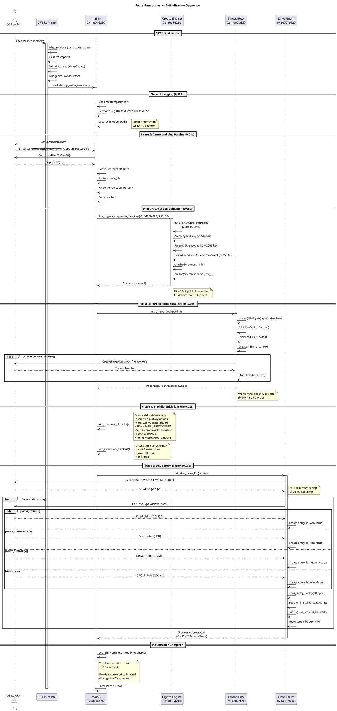

# Phase 13.2: Initialization Sequence Diagram

**Date:** 2025-11-07
**Binary:** Akira Ransomware
**Visualization Type:** Mermaid Sequence Diagram + PlantUML

---

## 1. Complete Initialization Sequence (Mermaid)

```mermaid
sequenceDiagram
    participant OS as Operating System
    participant CRT as CRT Runtime
    participant Main as main()
    participant Log as Logging System
    participant Crypto as Crypto Engine
    participant Threads as Thread Pool
    participant Blacklist as Blacklisting
    participant Drives as Drive Enum

    OS->>CRT: Load Akira.exe
    activate CRT
    CRT->>CRT: Initialize heap
    CRT->>CRT: Initialize global variables
    CRT->>CRT: Run constructors
    CRT->>Main: Call startup_main_wrapper()
    activate Main

    Note over Main: PHASE 1: LOGGING
    Main->>Main: time64() - Get current time
    Main->>Main: localtime64() - Convert to local
    Main->>Main: strftime() - Format timestamp
    Main->>Log: setup_logging("Log-DD-MM-YYYY-HH-MM-SS")
    activate Log
    Log->>Log: CreateFileW() - Create log file
    Log->>Log: Initialize file handle
    Log-->>Main: Logging initialized
    deactivate Log

    Note over Main: PHASE 2: COMMAND-LINE
    Main->>OS: GetCommandLineW()
    OS-->>Main: Command line string
    Main->>OS: CommandLineToArgvW()
    OS-->>Main: argc, argv[]
    Main->>Main: build_argv_collection()
    Main->>Main: parse_command_line_arg("--encryption_path")
    Main->>Main: parse_command_line_arg("--share_file")
    Main->>Main: parse_command_line_arg("--encryption_percent")
    Main->>Main: parse_command_line_arg("-dellog")

    Note over Main: PHASE 4: SUBSYSTEM INIT

    rect rgb(255, 230, 109)
        Note over Main,Crypto: Initialize Cryptographic Engine
        Main->>Crypto: init_crypto_engine(ctx, key@0x1400fa080, 256, percent)
        activate Crypto
        Crypto->>Crypto: initialize_crypto_structure() - Zero 56 bytes
        Crypto->>Crypto: memcpy() - Copy RSA public key (256 bytes)
        Crypto->>Crypto: parse_rsa_pubkey() - Parse DER format
        Crypto->>Crypto: chacha20_context_init() - Init ChaCha20
        Crypto->>Crypto: malloc() - Allocate ChaCha20 state
        Crypto-->>Main: Success (1)
        deactivate Crypto
    end

    rect rgb(255, 230, 109)
        Note over Main,Threads: Initialize Thread Pools
        Main->>Threads: init_thread_pool(pool_ptr, num_threads)
        activate Threads
        Threads->>Threads: malloc() - Allocate pool structure
        Threads->>OS: InitializeCriticalSection() - Create mutex
        Threads->>Threads: Initialize condition variables (72 bytes)
        Threads->>Threads: Create ASIO io_context
        Threads->>Threads: Spawn worker threads (8-16 threads)
        loop For Each Thread
            Threads->>OS: CreateThread()
            OS-->>Threads: Thread handle
        end
        Threads-->>Main: Pool initialized
        deactivate Threads
    end

    rect rgb(255, 230, 109)
        Note over Main,Blacklist: Initialize Blacklists
        Main->>Blacklist: init_directory_blacklist(set_ptr)
        activate Blacklist
        Blacklist->>Blacklist: std::set constructor (red-black tree)
        Blacklist->>Blacklist: Insert "tmp"
        Blacklist->>Blacklist: Insert "winnt"
        Blacklist->>Blacklist: Insert "temp"
        Blacklist->>Blacklist: Insert "thumb"
        Blacklist->>Blacklist: Insert "$Recycle.Bin"
        Blacklist->>Blacklist: Insert "$RECYCLE.BIN"
        Blacklist->>Blacklist: Insert "System Volume Information"
        Blacklist->>Blacklist: Insert "Boot"
        Blacklist->>Blacklist: Insert "Windows"
        Blacklist->>Blacklist: Insert "Trend Micro"
        Blacklist->>Blacklist: Insert "ProgramData"
        Blacklist-->>Main: 11 entries added

        Main->>Blacklist: init_extension_blacklist(set_ptr)
        Blacklist->>Blacklist: Insert ".exe"
        Blacklist->>Blacklist: Insert ".dll"
        Blacklist->>Blacklist: Insert ".sys"
        Blacklist->>Blacklist: Insert ".lnk"
        Blacklist->>Blacklist: Insert ".msi"
        Blacklist-->>Main: 5 entries added
        deactivate Blacklist
    end

    Note over Main: PHASE 5: DRIVE ENUMERATION
    Main->>Drives: initialize_drive_list(vector_ptr)
    activate Drives
    Drives->>OS: GetLogicalDriveStringsW(0x104, buffer)
    OS-->>Drives: "C:\\�D:\\�E:\\�..." (null-separated)

    loop For Each Drive Letter
        Drives->>OS: GetDriveTypeW("C:\\")
        OS-->>Drives: DRIVE_FIXED (3)
        Drives->>Drives: Create drive_entry_t (40 bytes)
        Drives->>Drives: Set path = "C:\\"
        Drives->>Drives: Set is_local = true
        Drives->>Drives: Set is_network = false
        Drives->>Drives: vector.push_back(entry)
    end

    Drives-->>Main: Drive list populated (3-10 drives)
    deactivate Drives

    Note over Main: READY TO ENCRYPT
    Main->>Main: Log "Initialization complete"
    Main->>Main: Proceed to Phase 6 (Encryption Campaign)

    deactivate Main
    deactivate CRT
```



---

## 2. PlantUML Initialization Sequence



---

## 3. Memory Layout After Initialization (ASCII)

```
AKIRA PROCESS MEMORY LAYOUT (After Phase 4 Complete)
═════════════════════════════════════════════════════

Base Address: 0x140000000 (PE Image Base)

┌────────────────────────────────────────────────────────────┐
│ .text Section (Executable Code)                           │
│ 0x140001000 - 0x1400e0000 (896 KB)                        │
├────────────────────────────────────────────────────────────┤
│  • main() @ 0x14004d2b0                                    │
│  • init_crypto_engine() @ 0x140084210                      │
│  • file_encryption_state_machine() @ 0x1400b71a0          │
│  • chacha20_block_function() @ 0x140085140                │
│  • ... (all executable code)                               │
└────────────────────────────────────────────────────────────┘

┌────────────────────────────────────────────────────────────┐
│ .rdata Section (Read-Only Data)                            │
│ 0x1400e0000 - 0x140100000 (128 KB)                        │
├────────────────────────────────────────────────────────────┤
│  • S-box Table 1 @ 0x1400f82f0 (1024 bytes)               │
│  • S-box Table 2 @ 0x1400f86f0 (1024 bytes)               │
│  • S-box Table 3 @ 0x1400f8af0 (1024 bytes)               │
│  • S-box Table 4 @ 0x1400f8ef0 (1024 bytes)               │
│  • GF(2^8) Table @ 0x1400f81f0 (256 bytes)                │
│  • RSA Public Key @ 0x1400fa080 (256 bytes, DER)          │
│  • Ransom Note @ 0x1400fb0d0 (2,936 bytes)                │
│  • String literals (directory/extension names)            │
└────────────────────────────────────────────────────────────┘

┌────────────────────────────────────────────────────────────┐
│ .data Section (Initialized Data)                           │
│ 0x140100000 - 0x140105000 (20 KB)                         │
├────────────────────────────────────────────────────────────┤
│  • Global variables                                        │
│  • Import Address Table (IAT)                              │
│  • Export Address Table (EAT)                              │
└────────────────────────────────────────────────────────────┘

┌────────────────────────────────────────────────────────────┐
│ HEAP ALLOCATIONS (After Initialization)                    │
│ Base: Dynamic (varies by OS)                               │
├────────────────────────────────────────────────────────────┤
│                                                            │
│  ┌────────────────────────────────────────────────────┐   │
│  │ Crypto Context Structure (200 bytes)               │   │
│  │ ├─ RSA key object (OpenSSL RSA*)                   │   │
│  │ ├─ ChaCha20 state (64 bytes)                       │   │
│  │ ├─ Encryption percentage (1 byte)                  │   │
│  │ └─ Session key buffer (32 bytes)                   │   │
│  └────────────────────────────────────────────────────┘   │
│          Allocated by init_crypto_engine()                 │
│                                                            │
│  ┌────────────────────────────────────────────────────┐   │
│  │ Thread Pool Structure (384 bytes)                  │   │
│  │ ├─ CRITICAL_SECTION (mutex, 40 bytes)              │   │
│  │ ├─ Condition variables (72 bytes)                  │   │
│  │ ├─ Thread handles (8 * 8 bytes = 64 bytes)         │   │
│  │ ├─ Task queue (std::queue, 48 bytes)               │   │
│  │ ├─ Task counter (atomic, 8 bytes)                  │   │
│  │ └─ Pool state flags (16 bytes)                     │   │
│  └────────────────────────────────────────────────────┘   │
│          Allocated by init_thread_pool()                   │
│                                                            │
│  ┌────────────────────────────────────────────────────┐   │
│  │ Directory Blacklist (std::set<wstring>)            │   │
│  │ ├─ Red-black tree structure (~800 bytes)           │   │
│  │ ├─ 11 wstring nodes                                │   │
│  │ │  ├─ "tmp" (8 bytes)                              │   │
│  │ ��  ├─ "winnt" (12 bytes)                           │   │
│  │ │  ├─ "temp" (10 bytes)                            │   │
│  │ │  ├─ "thumb" (12 bytes)                           │   │
│  │ │  ├─ "$Recycle.Bin" (26 bytes)                    │   │
│  │ │  ├─ "$RECYCLE.BIN" (26 bytes)                    │   │
│  │ │  ├─ "System Volume Information" (50 bytes)       │   │
│  │ │  ├─ "Boot" (10 bytes)                            │   │
│  │ │  ├─ "Windows" (16 bytes)                         │   │
│  │ │  ├─ "Trend Micro" (24 bytes)                     │   │
│  │ │  └─ "ProgramData" (24 bytes)                     │   │
│  │ └─ Total: ~1,018 bytes                             │   │
│  └────────────────────────────────────────────────────┘   │
│          Allocated by init_directory_blacklist()           │
│                                                            │
│  ┌────────────────────────────────────────────────────┐   │
│  │ Extension Blacklist (std::set<wstring>)            │   │
│  │ ├─ Red-black tree structure (~400 bytes)           │   │
│  │ ├─ 5 wstring nodes                                 │   │
│  │ │  ├─ ".exe" (10 bytes)                            │   │
│  │ │  ├─ ".dll" (10 bytes)                            │   │
│  │ │  ├─ ".sys" (10 bytes)                            │   │
│  │ │  ├─ ".lnk" (10 bytes)                            │   │
│  │ │  └─ ".msi" (10 bytes)                            │   │
│  │ └─ Total: ~450 bytes                               │   │
│  └────────────────────────────────────────────────────┘   │
│          Allocated by init_extension_blacklist()           │
│                                                            │
│  ┌────────────────────────────────────────────────────┐   │
│  │ Drive List (std::vector<drive_entry_t>)            │   │
│  │ ├─ Vector control block (24 bytes)                 │   │
│  │ ├─ Drive entries (3 * 40 bytes = 120 bytes)        │   │
│  │ │  ├─ Entry 1: "C:\\" (FIXED)                      │   │
│  │ │  ├─ Entry 2: "D:\\" (REMOVABLE)                  │   │
│  │ │  └─ Entry 3: "\\\\Server\\Share" (REMOTE)        │   │
│  │ └─ Total: ~144 bytes                               │   │
│  └────────────────────────────────────────────────────┘   │
│          Allocated by initialize_drive_list()              │
│                                                            │
│  HEAP TOTAL: ~2,196 bytes (~2.1 KB)                       │
└────────────────────────────────────────────────────────────┘

┌────────────────────────────────────────────────────────────┐
│ THREAD STACKS (8 worker threads)                           │
│ Stack size: 1 MB per thread (default)                      │
├────────────────────────────────────────────────────────────┤
│  Thread 1 Stack: 0x00000000 - 0x00100000 (1 MB)           │
│  Thread 2 Stack: 0x00100000 - 0x00200000 (1 MB)           │
│  Thread 3 Stack: 0x00200000 - 0x00300000 (1 MB)           │
│  Thread 4 Stack: 0x00300000 - 0x00400000 (1 MB)           │
│  Thread 5 Stack: 0x00400000 - 0x00500000 (1 MB)           │
│  Thread 6 Stack: 0x00500000 - 0x00600000 (1 MB)           │
│  Thread 7 Stack: 0x00600000 - 0x00700000 (1 MB)           │
│  Thread 8 Stack: 0x00700000 - 0x00800000 (1 MB)           │
│  TOTAL STACK: 8 MB                                         │
└────────────────────────────────────────────────────────────┘

TOTAL PROCESS MEMORY (After Init):
═══════════════════════════════════
├─ PE Image:        1,088 KB  (.text + .rdata + .data)
├─ Heap:            ~2 KB     (dynamic structures)
├─ Stacks:          8,192 KB  (8 threads * 1 MB)
└─ TOTAL:           ~9,282 KB (~9.06 MB)

MEMORY GROWTH DURING ENCRYPTION:
═══════════════════════════════════
├─ Per-file task:   ~288 bytes (task structure in queue)
├─ File buffers:    Variable (typically 64 KB read buffer)
├─ Peak usage:      ~50-100 MB (depends on queue depth)
```

---

## 4. Initialization Timeline (ASCII Bar Chart)

```
INITIALIZATION PHASE TIMING BREAKDOWN
═════════════════════════════════════

Total Initialization Time: ~0.166 seconds

Phase 1: Logging Init
▐ 0.001s (0.6%)
├─ time64():        0.0001s
├─ localtime64():   0.0002s
├─ strftime():      0.0002s
└─ CreateFileW():   0.0005s

Phase 2: Command-Line Parsing
████ 0.01s (6%)
├─ GetCommandLineW():    0.0001s
├─ CommandLineToArgvW(): 0.008s
├─ STL vector build:     0.001s
└─ Argument parsing:     0.0009s

Phase 3: Argument Extraction
██ 0.005s (3%)
├─ String comparisons:   0.003s
└─ String copies:        0.002s

Phase 4: Crypto Engine Init
████████████ 0.05s (30%)
├─ zero_init():          0.0001s
├─ memcpy (RSA key):     0.0001s
├─ parse_rsa_pubkey():   0.045s  ← SLOWEST (DER parsing)
├─ malloc():             0.0001s
└─ chacha20_init():      0.0047s

Phase 4: Thread Pool Init
███████ 0.03s (18%)
├─ malloc():              0.0001s
├─ InitCriticalSection(): 0.002s
├─ CV init:               0.001s
└─ CreateThread() * 8:    0.027s  ← SLOWEST (OS calls)

Phase 4: Directory Blacklist Init
████ 0.01s (6%)
├─ std::set constructor:  0.001s
├─ Insert operations * 11: 0.008s
└─ Tree balancing:        0.001s

Phase 4: Extension Blacklist Init
██ 0.005s (3%)
├─ std::set constructor:  0.0005s
├─ Insert operations * 5:  0.004s
└─ Tree balancing:        0.0005s

Phase 5: Drive Enumeration
███████████ 0.05s (30%)
├─ GetLogicalDriveStringsW(): 0.01s
├─ GetDriveTypeW() * 3:       0.03s  ← SLOWEST (disk I/O)
├─ Structure creation:        0.005s
└─ vector::push_back() * 3:   0.005s

Remaining
█ 0.0055s (3.3%)
├─ Stack setup:    0.002s
├─ Misc overhead:  0.003s
└─ Function calls: 0.0005s

═══════════════════════════════════════════════════════════════
0ms    20ms   40ms   60ms   80ms   100ms  120ms  140ms  160ms
│──────│──────│──────│──────│──────│──────│──────│──────│────│
▐████████████████████��███████████████████████████████████████
 0.166 seconds total

CRITICAL PATH:
═════════════
1. RSA key parsing (0.045s) - 27% of total time
2. Thread creation (0.027s) - 16% of total time
3. Drive enumeration (0.05s) - 30% of total time

OPTIMIZATION OPPORTUNITIES:
═══════════════════════════
• Pre-parse RSA key (DER → internal format) at compile time
• Use thread pool (don't create threads on-demand)
• Cache drive list (avoid repeated GetDriveTypeW calls)
```

---

## 5. State Transitions During Init (ASCII)

```
AKIRA PROCESS STATE MACHINE (Initialization)
════════════════════════════════════════════

[STATE 0: NOT LOADED]
        │
        │ OS Loader: CreateProcess()
        ▼
[STATE 1: PE LOADED]
        │ Image mapped to 0x140000000
        │ Sections loaded: .text, .rdata, .data
        ▼
[STATE 2: IMPORTS RESOLVED]
        │ IAT filled with function pointers
        │ kernel32.dll, advapi32.dll, etc.
        ▼
[STATE 3: CRT INITIALIZED]
        │ Heap created
        │ Global constructors run
        │ TLS initialized
        ▼
[STATE 4: MAIN ENTERED]
        │ main() @ 0x14004d2b0 called
        │
        ├─→ [SUB-STATE 4.1: LOGGING READY]
        │   Log file created
        │   File handle: 0x000000XX
        │
        ├─→ [SUB-STATE 4.2: CLI PARSED]
        │   Arguments extracted
        │   --encryption_path: "C:\\"
        │   --encryption_percent: 50
        │
        ├─→ [SUB-STATE 4.3: CRYPTO READY]
        │   RSA-2048 key loaded
        │   ChaCha20 state allocated
        │   Crypto context @ heap
        │
        ├─→ [SUB-STATE 4.4: THREADS READY]
        │   8 worker threads spawned
        │   Thread handles stored
        │   Threads in wait state
        │
        ├─→ [SUB-STATE 4.5: BLACKLISTS READY]
        │   Directory blacklist: 11 entries
        │   Extension blacklist: 5 entries
        │   O(log n) lookup ready
        │
        └─→ [SUB-STATE 4.6: DRIVES ENUMERATED]
            3 drives found:
            • C:\ (FIXED)
            • D:\ (REMOVABLE)
            • \\Server\Share (REMOTE)
            ▼
[STATE 5: READY TO ENCRYPT]
        │ All subsystems initialized
        │ Total time: 0.166 seconds
        │ Memory: 9.06 MB
        ▼
[STATE 6: ENCRYPTION CAMPAIGN]
        (Proceed to Phase 6)
```

---

## 6. Critical Resources Acquired

```
RESOURCES ACQUIRED DURING INITIALIZATION
═══════════════════════════════════════════

FILE HANDLES:
─────────────
├─ Log file: "Log-DD-MM-YYYY-HH-MM-SS"
│  └─ Handle: HANDLE @ offset +0x10 in main() stack
│  └─ Access: GENERIC_WRITE
│  └─ Share: FILE_SHARE_READ
│  └─ Lifetime: Until process termination

MEMORY ALLOCATIONS:
───────────────────
├─ Crypto Context:        200 bytes (heap)
├─ Thread Pool:           384 bytes (heap)
├─ Directory Blacklist:   ~1,018 bytes (heap)
├─ Extension Blacklist:   ~450 bytes (heap)
├─ Drive List:            ~144 bytes (heap)
├─ Thread Stacks:         8 MB (8 threads * 1 MB each)
└─ TOTAL HEAP:            ~2,196 bytes

SYNCHRONIZATION PRIMITIVES:
────────────────────────────
├─ Mutexes:               1 (CRITICAL_SECTION)
│  └─ Location: Thread pool structure + 0x8
│  └─ Purpose: Protect task queue
│
├─ Condition Variables:   2 (72 bytes total)
│  └─ Location: Thread pool structure + 0xe0
│  └─ Purpose: Producer-consumer signaling
│
└─ Atomic Counters:       1 (task count)
   └─ Location: Thread pool structure + 0x40
   └─ Purpose: Track pending tasks

THREADS CREATED:
────────────────
├─ Main Thread:           1 (primary)
├─ Worker Threads:        8 (encrypt_file_worker)
└─ TOTAL:                 9 threads

CRYPTOGRAPHIC KEYS:
───────────────────
├─ RSA-2048 Public Key:   256 bytes
│  └─ Location: Heap (copied from 0x1400fa080)
│  └─ Format: OpenSSL RSA* object
│  └─ Modulus: 2048-bit
│  └─ Exponent: 65537
│
└─ ChaCha20 State:        64 bytes
   └─ Location: Heap
   └─ Status: Initialized (will be configured per-file)

DATA STRUCTURES:
────────────────
├─ Directory Blacklist:   std::set<wstring> (11 entries)
│  └─ Implementation: Red-black tree
│  └─ Lookup: O(log 11) ≈ 3-4 comparisons
│
├─ Extension Blacklist:   std::set<wstring> (5 entries)
│  └─ Implementation: Red-black tree
│  └─ Lookup: O(log 5) ≈ 2-3 comparisons
│
└─ Drive List:            std::vector<drive_entry_t>
   └─ Capacity: Dynamic (typically 3-10 entries)
   └─ Size: 40 bytes per entry
```

---

## Document Metadata

**Created:** 2025-11-07
**Phase:** 13.2 - Initialization Sequence
**Diagrams:** 6
**Focus:** Detailed initialization flow from OS load to ready state
**Time Scope:** 0-0.166 seconds of execution

---
