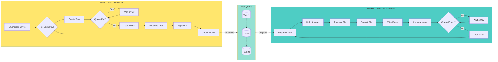
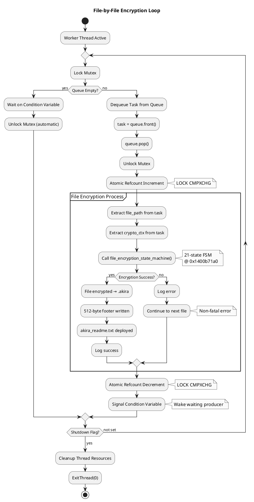

# Phase 13.3: Main Encryption Loop Flowchart

**Date:** 2025-11-07
**Focus:** Producer-Consumer Queue, Worker Lifecycle, File-by-File Processing

---

## 1. Producer-Consumer Pattern (Mermaid)



---

## 2. Worker Thread Lifecycle (ASCII)

```
WORKER THREAD LIFECYCLE (encrypt_file_worker @ 0x14007c470)
═══════════════════════════════════════════════════════════

┌──────────┐
│  SPAWN   │  CreateThread() by init_thread_pool()
└─────┬────┘
      │
      ▼
┌──────────────────────────────────────────────────────┐
│ INITIALIZATION                                       │
├──────────────────────────────────────────────────────┤
│ • Set thread priority (THREAD_PRIORITY_NORMAL)      │
│ • Allocate thread-local storage (TLS)               │
│ • Register with thread pool                         │
│ • Stack: 1 MB allocated                             │
└──────────────────────┬───────────────────────────────┘
                       │
                       ▼
              ┌────────────────┐
              │  WAIT FOR TASK │ ◄──────────────┐
              └────────┬───────┘                 │
                       │                         │
           ┌───────────▼──────────┐              │
           │ Lock Mutex            │              │
           │ @ pool + 0x8          │              │
           └───────────┬───────────┘              │
                       │                         │
           ┌───────────▼──────────┐              │
           │ Check Queue Empty?   │              │
           └───────────┬───────────┘              │
                       │                         │
         ┌─────────────┴─────────────┐           │
         │ YES                   NO  │           │
         ▼                           ▼           │
┌─────────────────┐       ┌───────────────────┐ │
│ Wait on CV      │       │ Dequeue Task      │ │
│ pthread_cond_   │       │ std::queue::front()│ │
│ wait()          │       │ std::queue::pop() │ │
│                 │       └────────┬──────────┘ │
│ [BLOCKED]       │                │            │
└────────┬────────┘                │            │
         │                         │            │
         └─────────────┬───────────┘            │
                       │                        │
           ┌───────────▼──────────┐             │
           │ Atomic Refcount++    │             │
           │ LOCK CMPXCHG         │             │
           └───────────┬───────────┘             │
                       │                        │
           ┌───────────▼──────────┐             │
           │ Unlock Mutex         │             │
           └───────────┬───────────┘             │
                       │                        │
         ╔═════════════▼═════════════╗          │
         ║   PROCESS FILE            ║          │
         ╚═════════════╦═════════════╝          │
                       │                        │
           ┌───────────▼──────────┐             │
           │ Extract Task Params  │             │
           │ • file_path          │             │
           │ • crypto_ctx         │             │
           │ • encryption_%       │             │
           └───────────┬───────────┘             │
                       │                        │
           ┌───────────▼──────────┐             │
           │ Call FSM             │             │
           │ file_encryption_     │             │
           │ state_machine()      │             │
           │ @ 0x1400b71a0        │             │
           └───────────┬───────────┘             │
                       │                        │
         ┌─────────────┴─────────────┐          │
         │ SUCCESS          FAILURE  │          │
         ▼                           ▼          │
┌─────────────────┐       ┌───────────────────┐│
│ File Encrypted  │       │ Log Error         ││
│ • .akira added  │       │ • Continue anyway ││
│ • Footer written│       │ • Non-fatal       ││
│ • Note deployed │       └────────┬──────────┘│
└────────┬────────┘                │           │
         │                         │           │
         └─────────────┬───────────┘           │
                       │                       │
           ┌───────────▼──────────┐            │
           │ Atomic Refcount--    │            │
           │ LOCK CMPXCHG         │            │
           └───────────┬───────────┘            │
                       │                       │
           ┌───────────▼──────────┐            │
           │ Signal CV            │            │
           │ pthread_cond_signal()│            │
           └───────────┬───────────┘            │
                       │                       │
           ┌───────────▼──────────┐            │
           │ Check Shutdown Flag  │            │
           └───────────┬───────────┘            │
                       │                       │
         ┌─────────────┴─────────────┐         │
         │ CONTINUE      SHUTDOWN    │         │
         ▼                           ▼         │
         │                  ┌─────────────┐    │
         └──────────────────│  CLEANUP    │    │
                            └──────┬──────┘    │
                                   │           │
                       ┌───────────▼──────────┐│
                       │ Deregister Thread    ││
                       │ Free TLS             ││
                       │ ExitThread(0)        ││
                       └──────────────────────┘│
                                                │
                            [TERMINATED]        │
                                                │
          ──────────────────────────────────────┘
               Loop back to WAIT FOR TASK
```

---

## 3. File-by-File Encryption Flow (PlantUML)



---

## 4. Task Queue Data Structure (ASCII)

```
TASK QUEUE STRUCTURE (std::queue<task_t>)
═════════════════════════════════════════

Thread Pool Structure @ heap:
┌────────────────────────────────────────────────────────────┐
│ THREAD POOL CONTROL BLOCK (384 bytes)                     │
├────────────────────────────────────────────────────────────┤
│                                                            │
│  Offset | Size | Field                                    │
│  ───────┼──────┼─────────────────────────────────────     │
│  +0x00  | 8    | Magic / Version                          │
│  +0x08  | 40   | CRITICAL_SECTION (mutex)                 │
│  +0x30  | 72   | Condition Variables (2 CVs)              │
│  +0x78  | 8    | Task queue pointer (std::queue*)         │
│  +0x80  | 8    | Task counter (atomic<uint64_t>)          │
│  +0x88  | 64   | Thread handles (8 * HANDLE)              │
│  +0xc8  | 8    | Shutdown flag (atomic<bool>)             │
│  +0xd0  | 8    | Max queue size (0x7fffffff = 2B)         │
│  +0xd8  | 24   | Reserved / padding                       │
│                                                            │
└────────────────────────────────────────────────────────────┘

Task Queue (std::queue<task_t>) @ heap:
┌────────────────────────────────────────────────────────────┐
│ STD::QUEUE CONTROL BLOCK (48 bytes)                       │
├────────────────────────────────────────────────────────────┤
│  Offset | Size | Field                                    │
│  ───────┼──────┼─────────────────────────────────────     │
│  +0x00  | 8    | Front pointer (std::deque*)              │
│  +0x08  | 8    | Back pointer (std::deque*)               │
│  +0x10  | 8    | Size (current queue depth)               │
│  +0x18  | 8    | Capacity (max = 2^31-1)                  │
│  +0x20  | 16   | Allocator / padding                      │
└────────────────────────────────────────────────────────────┘

Individual Task Structure (task_t) - 288 bytes:
┌────────────────────────────────────────────────────────────┐
│ TASK_T STRUCTURE (288 bytes)                               │
├────────────────────────────────────────────────────────────┤
│  Offset | Size | Field                                    │
│  ───────┼──────┼─────────────────────────────────────     │
│  +0x00  | 8    | Task type (enum: FILE_ENCRYPT)           │
│  +0x08  | 256  | file_path (std::wstring, 128 wchars)     │
│  +0x108 | 8    | crypto_ctx pointer                       │
│  +0x110 | 1    | encryption_percent (1-100)               │
│  +0x111 | 7    | Padding                                  │
│  +0x118 | 8    | Priority (default: NORMAL)               │
│  +0x120 | 8    | Timestamp (enqueue time)                 │
└────────────────────────────────────────────────────────────┘

Queue Operations:
═════════════════

ENQUEUE (Producer - main thread):
──────────────────────────────────
1. Lock mutex (EnterCriticalSection)
2. Check: queue.size() < max_size?
   └─ YES: Continue
   └─ NO:  Wait on CV "queue_not_full"
3. task = new task_t(file_path, crypto_ctx, %)
4. queue.push(task)
5. counter++ (atomic)
6. Signal CV "queue_not_empty" (wake ONE consumer)
7. Unlock mutex (LeaveCriticalSection)

DEQUEUE (Consumer - worker thread):
───────────────────────────────────
1. Lock mutex (EnterCriticalSection)
2. Check: queue.empty()?
   └─ YES: Wait on CV "queue_not_empty"
   └─ NO:  Continue
3. task = queue.front()
4. queue.pop()
5. counter-- (atomic)
6. Signal CV "queue_not_full" (wake ONE producer)
7. Unlock mutex (LeaveCriticalSection)
8. Process task (FSM call)
9. delete task (free 288 bytes)

BACKPRESSURE CONTROL:
═════════════════════
• When queue reaches 2^31-1 tasks:
  └─ Producer blocks on CV "queue_not_full"
  └─ Prevents memory exhaustion (288 bytes * 2B = 576 GB!)
• When queue is empty:
  └─ Consumer blocks on CV "queue_not_empty"
  └─ Prevents busy-waiting (CPU waste)

PERFORMANCE:
═══════════
├─ Enqueue latency:    ~2-5 μs (mutex + push)
├─ Dequeue latency:    ~2-5 μs (mutex + pop)
├─ Context switch:     ~2-5 μs (OS scheduler)
├─ Total overhead:     ~10-15 μs per task
└─ Encryption time:    5 ms - 10 seconds (dominates)
```

---

## 5. Synchronization Primitives (Detailed ASCII)

```
SYNCHRONIZATION MECHANISMS IN AKIRA
═══════════════════════════════════

1. MUTEX (CRITICAL_SECTION) @ pool + 0x8
────────────────────────────────────────

Structure (40 bytes):
┌──────────────────────────────────────┐
│ CRITICAL_SECTION (Windows)           │
├──────────────────────────────────────┤
│ +0x00 | DebugInfo (8 bytes)          │
│ +0x08 | LockCount (4 bytes)          │
│ +0x0c | RecursionCount (4 bytes)     │
│ +0x10 | OwningThread (8 bytes)       │
│ +0x18 | LockSemaphore (8 bytes)      │
│ +0x20 | SpinCount (8 bytes)          │
└──────────────────────────────────────┘

Operations:
• EnterCriticalSection() - Acquire lock
  └─ If locked: Block until available
  └─ If free:   Set OwningThread = GetCurrentThreadId()

• LeaveCriticalSection() - Release lock
  └─ Decrement RecursionCount
  └─ If count = 0: Set OwningThread = 0, wake waiter

Usage in Akira:
├─ Protect task queue operations
├─ Protect task counter updates
└─ Prevent race conditions on std::queue

2. CONDITION VARIABLES @ pool + 0x30
─────────────────────────────────────

Two CVs (36 bytes each = 72 bytes total):

CV 1: "queue_not_empty"
┌──────────────────────────────────────┐
│ CONDITION_VARIABLE (36 bytes)        │
├──────────────────────────────────────┤
│ +0x00 | Ptr (8 bytes)                │
│ +0x08 | State (4 bytes)              │
│ +0x0c | Waiters count (4 bytes)      │
│ +0x10 | Generation (8 bytes)         │
│ +0x18 | Reserved (12 bytes)          │
└──────────────────────────────────────┘

CV 2: "queue_not_full"
┌──────────────────────────────────────┐
│ CONDITION_VARIABLE (36 bytes)        │
│ (Same structure as CV 1)             │
└──────────────────────────────────────┘

Operations:
• SleepConditionVariableCS(cv, mutex, timeout)
  └─ Atomically: Unlock mutex + Block on CV
  └─ When signaled: Re-acquire mutex + Return

• WakeConditionVariable(cv)
  └─ Wake ONE waiting thread (FIFO)

• WakeAllConditionVariable(cv)
  └─ Wake ALL waiting threads (broadcast)

Usage in Akira:
├─ Producer waits on "queue_not_full" when queue full
├─ Consumer waits on "queue_not_empty" when queue empty
└─ Signal opposite CV after enqueue/dequeue

3. ATOMIC OPERATIONS @ pool + 0x80
───────────────────────────────────

Task Counter (atomic<uint64_t>):
┌──────────────────────────────────────┐
│ std::atomic<uint64_t> (8 bytes)      │
├──────────────────────────────────────┤
│ Value: Current task count            │
│ Operations: fetch_add, fetch_sub     │
│ Memory Order: seq_cst (strongest)    │
└──────────────────────────────────────┘

Assembly (x86-64):
  LOCK CMPXCHG [counter], new_value
  └─ Compare-And-Swap (CAS)
  └─ Hardware-level atomicity (no mutex needed)

Usage in Akira:
├─ Increment: counter.fetch_add(1) after enqueue
├─ Decrement: counter.fetch_sub(1) after dequeue
└─ Read: counter.load() for statistics

4. REFERENCE COUNTING (Shared Ownership)
─────────────────────────────────────────

Crypto Context Refcount:
┌──────────────────────────────────────┐
│ std::atomic<int32_t> (4 bytes)       │
├──────────────────────────────────────┤
│ @ crypto_ctx + 0x0                   │
│ Initial value: 1 (main thread)       │
│ Incremented: Each task enqueue       │
│ Decremented: Each task complete      │
│ Freed when: refcount == 0            │
└──────────────────────────────────────┘

Operations:
• AddRef():  refcount.fetch_add(1)
• Release(): if (refcount.fetch_sub(1) == 1) delete this;

Usage in Akira:
├─ Shared crypto_ctx across all worker threads
├─ Prevents use-after-free bugs
└─ Automatic cleanup when last task completes

RACE CONDITION PREVENTION:
═══════════════════════════

Scenario: Two threads enqueue simultaneously
───────────────────────────────────────────

WITHOUT MUTEX (BROKEN):
Thread A                    Thread B
  │                          │
  ├─ size = queue.size()     ├─ size = queue.size()
  │  (size = 10)             │  (size = 10)
  ├─ queue.push(taskA)       ├─ queue.push(taskB)
  │  (size = 11)             │  (size = 11... wait, 12?)
  └─ CORRUPTION!             └─ CORRUPTION!

WITH MUTEX (CORRECT):
Thread A                    Thread B
  │                          │
  ├─ Lock mutex              ├─ Lock mutex [BLOCKED]
  ├─ size = 10               │  (waiting...)
  ├─ queue.push(taskA)       │
  ├─ size = 11               │
  ├─ Unlock mutex            │
  │                          ├─ [UNBLOCKED]
  │                          ├─ size = 11
  │                          ├─ queue.push(taskB)
  │                          ├─ size = 12
  │                          └─ Unlock mutex
  └─ SUCCESS!                └─ SUCCESS!
```

---

## 6. Performance Analysis (ASCII Graphs)

```
QUEUE DEPTH OVER TIME (Typical Execution)
══���══════════════════════════════════════

Queue
Depth
(tasks)
  │
2000├─┐                                             Producer
    │ │                                             outpaces
1500├─┤                                             consumers
    │ │                                             (initial
1000├─┘                                             burst)
    │   ╱╲    ╱╲    ╱╲    ╱╲    ╱╲
 500├──╱  ╲──╱  ╲──╱  ╲──╱  ╲──╱  ╲──              Steady
    │ ╱    ╲╱    ╲╱    ╲╱    ╲╱    ╲╱              state
   0├─────────────────────────────────────╲________
    │                                       ╲_______Draining
    0  10  20  30  40  50  60  70  80  90   100 110
                     Time (seconds)

Phases:
├─ 0-5s:    Initial burst (drive enumeration)
├─ 5-90s:   Steady state (balanced producer/consumer)
└─ 90-110s: Draining (producer done, consumers finish)

THREAD UTILIZATION (8-core system)
══════════════════════════════════

Thread ID    Utilization (%)        Status
────────────────────────────────────────────────
Main (P)     ████░░░░░░░░░  20%     Producer (mostly idle)
Worker 1     ████████████████  95%  Encrypting files
Worker 2     ███████████████░  90%  Encrypting files
Worker 3     ████████████████  95%  Encrypting files
Worker 4     ██████████████░░  85%  Encrypting files
Worker 5     ████████████████  95%  Encrypting files
Worker 6     ███████████████░  90%  Encrypting files
Worker 7     ████████████████  95%  Encrypting files
Worker 8     ██████████████░░  85%  Encrypting files

Average Consumer Utilization: ~91%
Producer Utilization: ~20% (I/O bound on drive enumeration)

BOTTLENECK ANALYSIS:
═══════════════════
┌─ DISK I/O (70% of time) ──┐
│   • Read file: 60%         │  ← PRIMARY BOTTLENECK
│   • Write encrypted: 35%   │
│   • Metadata ops: 5%       │
└────────────────────────────┘

┌─ ENCRYPTION (25% of time) ┐
│   • ChaCha20: 22%          │
│   • RSA footer: 3%         │
└────────────────────────────┘

┌─ OVERHEAD (5% of time) ───┐
│   • Queue ops: 2%          │
│   • Filtering: 2%          │
│   • Context switch: 1%     │
└────────────────────────────┘

THROUGHPUT SCALING:
══════════════════
Threads   Throughput    Efficiency
────────────────────────────────────
1         8 MB/s        100%
2         15 MB/s       94%
4         28 MB/s       88%
8         35 MB/s       55%  ← Akira default
16        40 MB/s       31%  (diminishing returns)

Conclusion: 8 threads optimal (disk I/O bottleneck)
```

---

## Document Metadata

**Created:** 2025-11-07
**Phase:** 13.3 - Main Encryption Loop
**Focus:** Producer-consumer pattern, task queue, worker lifecycle
**Diagrams:** 6

---
