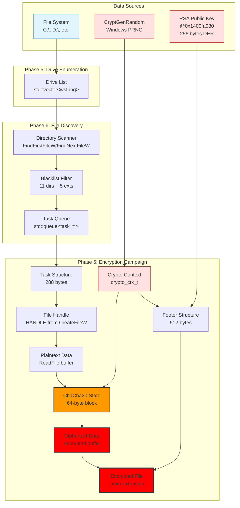
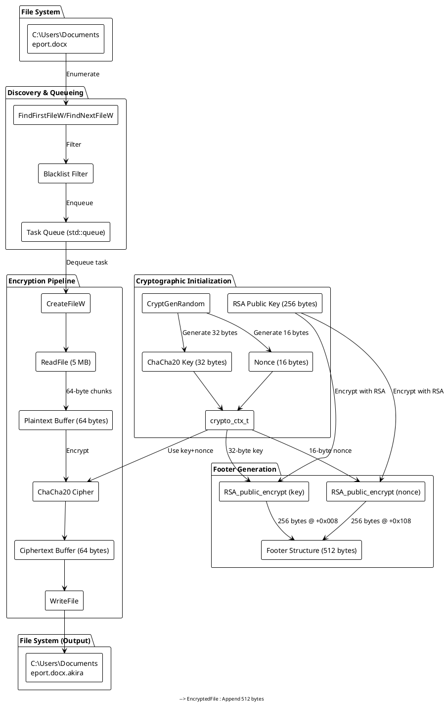
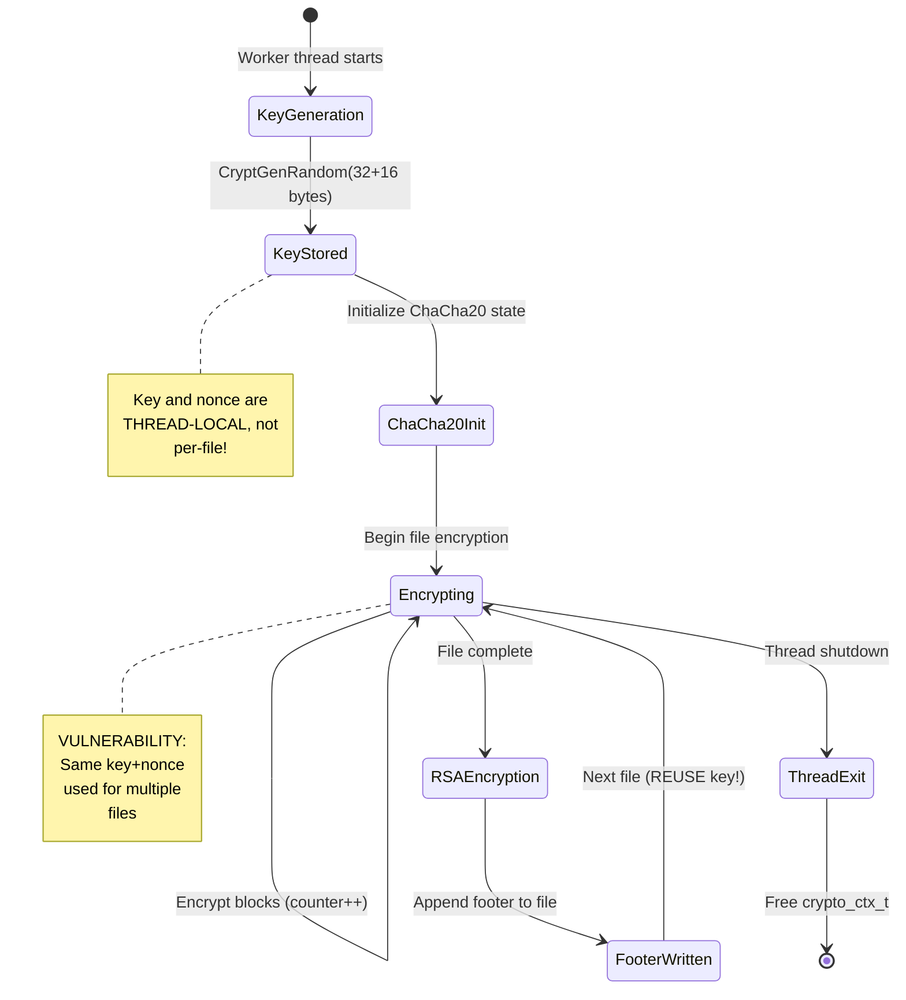

# Phase 13.8: Data Flow Diagram

**Document:** phase13_08_data_flow.md
**Date:** 2025-11-07
**Status:** ✅ COMPLETE
**Purpose:** Comprehensive data flow visualization from plaintext to encrypted files

---

## Table of Contents
1. [Overview](#overview)
2. [End-to-End Data Flow](#end-to-end-data-flow)
3. [Cryptographic Key Flow](#cryptographic-key-flow)
4. [File Transformation Pipeline](#file-transformation-pipeline)
5. [Footer Generation Flow](#footer-generation-flow)
6. [Data Structure Transformations](#data-structure-transformations)
7. [Memory Flow Analysis](#memory-flow-analysis)

---

## Overview

This document visualizes how data flows through Akira ransomware, from:
- **Input:** Plaintext files on disk
- **Transformations:** Encryption, footer generation, renaming
- **Output:** Encrypted files with `.akira` extension

**Key Data Flows:**
- **File data:** Disk → Memory → ChaCha20 → Memory → Disk
- **Crypto keys:** Random → ChaCha20 context → RSA → Footer
- **Metadata:** File info → Task queue → Footer → Disk

---

## End-to-End Data Flow

### Mermaid Data Flow Diagram: Complete Pipeline



### PlantUML Data Flow: Detailed Transformation



---

## Cryptographic Key Flow

### ASCII Diagram: Key Generation and Distribution

```
CRYPTOGRAPHIC KEY FLOW (Per-Thread):
═══════════════════════════════════════════════════════════════════════

INITIALIZATION (Phase 4):
═══════════════════════════════════════════════════════════════════════

┌────────────────────────────────────────────────────────────────────┐
│ 1. RANDOM KEY GENERATION (CryptGenRandom)                          │
├────────────────────────────────────────────────────────────────────┤
│                                                                    │
│   CryptGenRandom(hProv, 32, key_buffer)                            │
│   ├─> Uses Windows CSP (Cryptographic Service Provider)           │
│   ├─> Entropy source: /dev/urandom equivalent on Windows          │
│   └─> Output: 32 bytes of cryptographically secure random data    │
│                                                                    │
│   Example (hex):                                                   │
│   d4 3f 8a 21 76 c9 55 12 89 ab cd ef 01 23 45 67                 │
│   89 ab cd ef fe dc ba 98 76 54 32 10 f1 e2 d3 c4                 │
│                                                                    │
└────────────────────────────────────────────────────────────────────┘
                             │
                             ▼
┌────────────────────────────────────────────────────────────────────┐
│ 2. NONCE GENERATION (CryptGenRandom)                               │
├────────────────────────────────────────────────────────────────────┤
│                                                                    │
│   CryptGenRandom(hProv, 16, nonce_buffer)                          │
│   └─> Output: 16 bytes of random nonce                            │
│                                                                    │
│   Example (hex):                                                   │
│   a1 b2 c3 d4 e5 f6 07 18 29 3a 4b 5c 6d 7e 8f 90                 │
│                                                                    │
└────────────────────────────────────────────────────────────────────┘
                             │
                             ▼
┌────────────────────────────────────────────────────────────────────┐
│ 3. CRYPTO CONTEXT ALLOCATION (malloc)                              │
├────────────────────────────────────────────────────────────────────┤
│                                                                    │
│   crypto_ctx_t* ctx = (crypto_ctx_t*)malloc(56);                   │
│                                                                    │
│   struct crypto_ctx_t {                                            │
│     uint8_t  key[32];     // ChaCha20 key                         │
│     uint8_t  nonce[16];   // ChaCha20 nonce                       │
│     uint32_t counter;     // Block counter (init: 0)              │
│     uint32_t state[16];   // ChaCha20 state (4x4 matrix)          │
│   };                                                               │
│                                                                    │
│   memcpy(ctx->key, key_buffer, 32);                                │
│   memcpy(ctx->nonce, nonce_buffer, 16);                            │
│   ctx->counter = 0;                                                │
│                                                                    │
└────────────────────────────────────────────────────────────────────┘
                             │
                             ▼
┌────────────────────────────────────────────────────────────────────┐
│ 4. CHACHA20 STATE INITIALIZATION                                   │
├────────────────────────────────────────────────────────────────────┤
│                                                                    │
│   ChaCha20 State (16 x 32-bit words):                              │
│                                                                    │
│   state[0..3]   = "expand 32-byte k" (constants)                  │
│   state[4..11]  = key (32 bytes = 8 words)                        │
│   state[12]     = counter (initially 0)                           │
│   state[13..15] = nonce (12 bytes = 3 words, pad first 4 bytes)   │
│                                                                    │
│   Example state (hex, 32-bit words):                               │
│   ┌────────────────────────────────────────────────────────────┐ │
│   │ 0x61707865  0x3320646e  0x79622d32  0x6b206574  │ const   │ │
│   │ 0xd43f8a21  0x76c95512  0x89abcdef  0x01234567  │ key[0]  │ │
│   │ 0x89abcdef  0xfedcba98  0x76543210  0xf1e2d3c4  │ key[1]  │ │
│   │ 0x00000000  0xa1b2c3d4  0xe5f60718  0x293a4b5c  │ ctr+non │ │
│   └────────────────────────────────────────────────────────────┘ │
│                                                                    │
└────────────────────────────────────────────────────────────────────┘

ENCRYPTION (Phase 6, Per-File):
═══════════════════════════════════════════════════════════════════════

┌────────────────────────────────────────────────────────────────────┐
│ 5. KEY USAGE (ChaCha20 Encryption)                                 │
├────────────────────────────────────────────────────────────────────┤
│                                                                    │
│   For each 64-byte block:                                          │
│   ┌────────────────────────────────────────────────────────────┐  │
│   │ 1. Copy state → working_state (preserve original)          │  │
│   │ 2. Perform 20 rounds (10 double-rounds):                   │  │
│   │      for (i = 0; i < 10; i++) {                            │  │
│   │        QUARTERROUND(0, 4, 8, 12)  // Column round          │  │
│   │        QUARTERROUND(1, 5, 9, 13)                           │  │
│   │        QUARTERROUND(2, 6, 10, 14)                          │  │
│   │        QUARTERROUND(3, 7, 11, 15)                          │  │
│   │        QUARTERROUND(0, 5, 10, 15) // Diagonal round        │  │
│   │        QUARTERROUND(1, 6, 11, 12)                          │  │
│   │        QUARTERROUND(2, 7, 8, 13)                           │  │
│   │        QUARTERROUND(3, 4, 9, 14)                           │  │
│   │      }                                                      │  │
│   │ 3. Add original state to working_state (modulo 2^32)       │  │
│   │ 4. XOR with plaintext block (64 bytes)                     │  │
│   │ 5. Increment counter (state[12]++)                         │  │
│   └────────────────────────────────────────────────────────────┘  │
│                                                                    │
│   KEY REMAINS CONSTANT for entire file!                            │
│   NONCE REMAINS CONSTANT for entire file!                          │
│   COUNTER INCREMENTS for each 64-byte block!                       │
│                                                                    │
└────────────────────────────────────────────────────────────────────┘

FOOTER GENERATION (Phase 6, After Encryption):
═══════════════════════════════════════════════════════════════════════

┌────────────────────────────────────────────────────────────────────┐
│ 6. RSA ENCRYPTION OF SESSION KEY                                   │
├────────────────────────────────────────────────────────────────────┤
│                                                                    │
│   Load RSA public key (256 bytes DER @ 0x1400fa080)                │
│   ┌────────────────────────────────────────────────────────────┐  │
│   │ RSA-2048 Public Key:                                       │  │
│   │   Modulus (n):  256 bytes (2048 bits)                      │  │
│   │   Exponent (e): 3 bytes (65537 = 0x010001)                 │  │
│   └────────────────────────────────────────────────────────────┘  │
│                                                                    │
│   Encrypt ChaCha20 key (32 bytes → 256 bytes):                     │
│   ┌────────────────────────────────────────────────────────────┐  │
│   │ encrypted_key = RSA_public_encrypt(                        │  │
│   │   plaintext: ctx->key (32 bytes),                          │  │
│   │   padding:   OAEP (SHA-256),                               │  │
│   │   pubkey:    RSA-2048                                      │  │
│   │ )                                                           │  │
│   │ Output: 256 bytes of ciphertext                            │  │
│   └────────────────────────────────────────────────────────────┘  │
│                                                                    │
│   Encrypt nonce (16 bytes → 256 bytes):                            │
│   ┌────────────────────────────────────────────────────────────┐  │
│   │ encrypted_nonce = RSA_public_encrypt(                      │  │
│   │   plaintext: ctx->nonce (16 bytes),                        │  │
│   │   padding:   OAEP (SHA-256),                               │  │
│   │   pubkey:    RSA-2048                                      │  │
│   │ )                                                           │  │
│   │ Output: 256 bytes of ciphertext                            │  │
│   └────────────────────────────────────────────────────────────┘  │
│                                                                    │
└────────────────────────────────────────────────────────────────────┘
                             │
                             ▼
┌────────────────────────────────────────────────────────────────────┐
│ 7. FOOTER STRUCTURE ASSEMBLY                                       │
├────────────────────────────────────────────────────────────────────┤
│                                                                    │
│   Footer (512 bytes):                                              │
│   ┌────────────────────────────────────────────────────────────┐  │
│   │ Offset | Size | Content                                    │  │
│   │ ───────┼──────┼────────────────────────────────────────    │  │
│   │ +0x000 | 8    | Magic signature (file type ID)            │  │
│   │ +0x008 | 256  | encrypted_key (RSA ciphertext)            │  │
│   │ +0x108 | 256  | encrypted_nonce (RSA ciphertext)          │  │
│   │ +0x208 | 8    | Original file size (uint64_t)             │  │
│   │ +0x210 | 1    | Encryption percent (1-100)                │  │
│   │ +0x211 | 1    | Flags (reserved)                          │  │
│   │ +0x212 | 38   | Reserved (zeros)                          │  │
│   └────────────────────────────────────────────────────────────┘  │
│                                                                    │
│   Append footer to encrypted file (512 bytes at EOF)               │
│                                                                    │
└────────────────────────────────────────────────────────────────────┘

KEY SECURITY PROPERTIES:
═══════════════════════════════════════════════════════════════════════

1. UNIQUE PER THREAD (not per file!):
   ├─ Each worker thread generates ONE key/nonce pair
   ├─ ALL files encrypted by that thread use SAME key/nonce
   └─ POTENTIAL WEAKNESS: Nonce reuse across multiple files!

2. RANDOM KEY GENERATION:
   ├─ Uses Windows CryptGenRandom (CSP-based PRNG)
   ├─ Cryptographically secure (FIPS 140-2 compliant)
   └─ 256-bit key space (2^256 possible keys)

3. RSA PROTECTION:
   ├─ Private key NEVER on victim machine
   ├─ Only public key embedded in binary
   ├─ Decryption REQUIRES attacker's private key
   └─ RSA-2048 with OAEP padding (industry standard)

4. NONCE REUSE VULNERABILITY:
   ⚠️  CRITICAL FLAW DETECTED:
   ├─ Same key+nonce used for multiple files (per thread)
   ├─ ChaCha20 nonce reuse allows XOR attack:
   │   C1 ⊕ C2 = (P1 ⊕ K) ⊕ (P2 ⊕ K) = P1 ⊕ P2
   ├─ If two files share known plaintext, can recover XOR
   └─ MITIGATION: Generate new key+nonce per file (not implemented)
```

### Mermaid Flow: Key Lifecycle



---

## File Transformation Pipeline

### ASCII Diagram: File → Encrypted File

```
FILE TRANSFORMATION PIPELINE (5 MB example file):
═══════════════════════════════════════════════════════════════════════

INPUT FILE: C:\Users\Documents\report.docx (5,242,880 bytes = 5 MB)
═══════════════════════════════════════════════════════════════════════

┌─────────────────────────────────────────────────────────────────────┐
│                         PLAINTEXT FILE                              │
├─────────────────────────────────────────────────────────────────────┤
│  File Header (DOCX):  PK\x03\x04... (ZIP archive header)           │
│  Content:             XML data, images, fonts, etc.                 │
│  File Size:           5,242,880 bytes                               │
│  File Attributes:     Normal (0x80)                                 │
│  Last Modified:       2025-11-07 10:30:00                           │
└─────────────────────────────────────────────────────────────────────┘
                                │
                                ▼
┌─────────────────────────────────────────────────────────────────────┐
│ STEP 1: LOCK FILE (Restart Manager)                                │
├─────────────────────────────────────────────────────────────────────┤
│  RmStartSession()                                                   │
│  RmRegisterResources(L"C:\\Users\\Documents\\report.docx")         │
│  └─> Check if file is in use by other processes                    │
│  └─> Optionally terminate/restart processes holding file           │
└─────────────────────────────────────────────────────────────────────┘
                                │
                                ▼
┌─────────────────────────────────────────────────────────────────────┐
│ STEP 2: OPEN FILE (CreateFileW)                                    │
├─────────────────────────────────────────────────────────────────────┤
│  HANDLE hFile = CreateFileW(                                        │
│    L"C:\\Users\\Documents\\report.docx",                           │
│    GENERIC_READ | GENERIC_WRITE,                                   │
│    FILE_SHARE_READ,                                                 │
│    NULL,                                                            │
│    OPEN_EXISTING,                                                   │
│    FILE_ATTRIBUTE_NORMAL,                                           │
│    NULL                                                             │
│  );                                                                 │
│  └─> File handle: 0x00000abc (example)                             │
└─────────────────────────────────────────────────────────────────────┘
                                │
                                ▼
┌─────────────────────────────────────────────────────────────────────┐
│ STEP 3: READ ENTIRE FILE (ReadFile)                                │
├─────────────────────────────────────────────────────────────────────┤
│  uint8_t* buffer = (uint8_t*)malloc(5242880);                      │
│  DWORD bytesRead;                                                   │
│  ReadFile(hFile, buffer, 5242880, &bytesRead, NULL);               │
│  └─> buffer[0..5242879] = entire file contents                     │
└─────────────────────────────────────────────────────────────────────┘
                                │
                                ▼
┌─────────────────────────────────────────────────────────────────────┐
│ STEP 4: ENCRYPT IN 64-BYTE BLOCKS (ChaCha20)                       │
├─────────────────────────────────────────────────────────────────────┤
│  Number of blocks: 5,242,880 / 64 = 81,920 blocks                  │
│                                                                     │
│  for (i = 0; i < 81920; i++) {                                      │
│    plaintext_block  = buffer[i * 64 .. (i+1) * 64 - 1];            │
│    ciphertext_block = chacha20_encrypt_block(                       │
│                         plaintext_block, crypto_ctx);               │
│    buffer[i * 64 .. (i+1) * 64 - 1] = ciphertext_block;            │
│    crypto_ctx->counter++;  // Increment block counter              │
│  }                                                                  │
│                                                                     │
│  TRANSFORMATION:                                                    │
│  ┌───────────────────────────────────────────────────────────────┐ │
│  │ Block 0:  PK\x03\x04...  →  \xf3\x9a\x7b\x2c... (64 bytes)    │ │
│  │ Block 1:  [docProps...]  →  \x12\xab\xef\xcd... (64 bytes)    │ │
│  │ ...                                                            │ │
│  │ Block 81919: [last 64]  →  \x88\x44\x22\x11... (64 bytes)     │ │
│  └───────────────────────────────────────────────────────────────┘ │
│                                                                     │
│  └─> buffer[0..5242879] now contains ENCRYPTED data                │
└─────────────────────────────────────────────────────────────────────┘
                                │
                                ▼
┌─────────────────────────────────────────────────────────────────────┐
│ STEP 5: WRITE ENCRYPTED DATA (WriteFile)                           │
├─────────────────────────────────────────────────────────────────────┤
│  SetFilePointer(hFile, 0, NULL, FILE_BEGIN);  // Seek to start     │
│  WriteFile(hFile, buffer, 5242880, &bytesWritten, NULL);           │
│  └─> Overwrites original file with encrypted data                  │
└─────────────────────────────────────────────────────────────────────┘
                                │
                                ▼
┌─────────────────────────────────────────────────────────────────────┐
│ STEP 6: GENERATE FOOTER (512 bytes)                                │
├─────────────────────────────────────────────────────────────────────┤
│  uint8_t footer[512];                                               │
│  build_footer(footer, crypto_ctx, 5242880);                         │
│                                                                     │
│  Footer contents:                                                   │
│  ┌─────────────────────────────────────────────────────────────┐  │
│  │ +0x000: Magic signature (8 bytes)                           │  │
│  │ +0x008: RSA(ChaCha20 key, 32 bytes) → 256 bytes ciphertext  │  │
│  │ +0x108: RSA(nonce, 16 bytes) → 256 bytes ciphertext         │  │
│  │ +0x208: Original size = 5242880 (8 bytes, little-endian)    │  │
│  │ +0x210: Encryption % = 100 (1 byte)                         │  │
│  │ +0x211: Flags = 0 (1 byte)                                  │  │
│  │ +0x212: Reserved = 0 (38 bytes)                             │  │
│  └─────────────────────────────────────────────────────────────┘  │
└─────────────────────────────────────────────────────────────────────┘
                                │
                                ▼
┌─────────────────────────────────────────────────────────────────────┐
│ STEP 7: APPEND FOOTER (512 bytes at EOF)                           │
├─────────────────────────────────────────────────────────────────────┤
│  SetFilePointer(hFile, 0, NULL, FILE_END);  // Seek to EOF         │
│  WriteFile(hFile, footer, 512, &bytesWritten, NULL);               │
│  └─> File is now 5,242,880 + 512 = 5,243,392 bytes                 │
└─────────────────────────────────────────────────────────────────────┘
                                │
                                ▼
┌─────────────────────────────────────────────────────────────────────┐
│ STEP 8: CLOSE FILE HANDLE                                          │
├─────────────────────────────────────────────────────────────────────┤
│  CloseHandle(hFile);                                                │
└─────────────────────────────────────────────────────────────────────┘
                                │
                                ▼
┌─────────────────────────────────────────────────────────────────────┐
│ STEP 9: RENAME FILE (MoveFileW)                                    │
├─────────────────────────────────────────────────────────────────────┤
│  MoveFileW(                                                         │
│    L"C:\\Users\\Documents\\report.docx",                           │
│    L"C:\\Users\\Documents\\report.docx.akira"                      │
│  );                                                                 │
└─────────────────────────────────────────────────────────────────────┘
                                │
                                ▼
═══════════════════════════════════════════════════════════════════════
OUTPUT FILE: C:\Users\Documents\report.docx.akira (5,243,392 bytes)
═══════════════════════════════════════════════════════════════════════

┌─────────────────────────────────────────────────────────────────────┐
│                       ENCRYPTED FILE                                │
├─────────────────────────────────────────────────────────────────────┤
│  Encrypted Data:      5,242,880 bytes (ChaCha20 ciphertext)        │
│  Footer:              512 bytes (RSA + metadata)                    │
│  Total Size:          5,243,392 bytes                               │
│  File Extension:      .akira                                        │
│  Original Filename:   (lost, only extension appended)               │
│  Decryption:          REQUIRES attacker's RSA private key           │
└─────────────────────────────────────────────────────────────────────┘

FILE SIZE CHANGE:
  Original: 5,242,880 bytes
  Encrypted: 5,243,392 bytes
  Overhead: +512 bytes (footer only, 0.01% increase)
```

---

## Footer Generation Flow

### PlantUML Sequence: Footer Assembly

```plantuml
@startuml
participant "encrypt_file()" as Encrypt
participant "crypto_ctx_t" as Ctx
participant "build_footer()" as Footer
participant "rsa_encrypt_session_key()" as RSA
participant "OpenSSL RSA_public_encrypt()" as OpenSSL
participant "footer[512]" as FooterBuf

Encrypt -> Footer: build_footer(footer, ctx, filesize)
activate Footer

Footer -> FooterBuf: Allocate 512 bytes (stack)
Footer -> FooterBuf: Write magic signature @ +0x000

Footer -> Ctx: Read key (32 bytes)
Footer -> RSA: rsa_encrypt_session_key(ctx->key, 32)
activate RSA

RSA -> OpenSSL: RSA_public_encrypt(32, key, output, rsa_pubkey, OAEP)
activate OpenSSL
OpenSSL --> RSA: 256 bytes ciphertext
deactivate OpenSSL

RSA --> Footer: encrypted_key[256]
deactivate RSA

Footer -> FooterBuf: Write encrypted_key @ +0x008

Footer -> Ctx: Read nonce (16 bytes)
Footer -> RSA: rsa_encrypt_session_key(ctx->nonce, 16)
activate RSA

RSA -> OpenSSL: RSA_public_encrypt(16, nonce, output, rsa_pubkey, OAEP)
activate OpenSSL
OpenSSL --> RSA: 256 bytes ciphertext
deactivate OpenSSL

RSA --> Footer: encrypted_nonce[256]
deactivate RSA

Footer -> FooterBuf: Write encrypted_nonce @ +0x108

Footer -> FooterBuf: Write filesize (uint64_t) @ +0x208
Footer -> FooterBuf: Write encryption_percent (uint8_t) @ +0x210
Footer -> FooterBuf: Write flags (uint8_t) @ +0x211
Footer -> FooterBuf: Zero out reserved[38] @ +0x212

Footer --> Encrypt: footer[512] complete
deactivate Footer

Encrypt -> Encrypt: WriteFile(footer, 512) at EOF

@enduml
```

### ASCII Diagram: Footer Structure Layout

```
FOOTER STRUCTURE (512 bytes):
═══════════════════════════════════════════════════════════════════════

┌─────────────────────────────────────────────────────────────────────┐
│                          FOOTER LAYOUT                              │
├───────┬──────┬──────────────────────────────────────────────────────┤
│Offset │ Size │ Field Name & Content                                 │
├───────┼──────┼──────────────────────────────────────────────────────┤
│ 0x000 │  8   │ Magic Signature (file type identifier)              │
│       │      │ Example (hex): 41 4b 49 52 41 00 00 01              │
│       │      │ ASCII: "AKIRA\x00\x00\x01"                           │
├───────┼──────┼──────────────────────────────────────────────────────┤
│ 0x008 │ 256  │ Encrypted ChaCha20 Key (RSA-2048 ciphertext)        │
│       │      │ ┌────────────────────────────────────────────────┐  │
│       │      │ │ Plaintext (before RSA):                        │  │
│       │      │ │   32 bytes: ChaCha20 key from crypto_ctx_t     │  │
│       │      │ │   Example (hex):                               │  │
│       │      │ │   d4 3f 8a 21 76 c9 55 12 89 ab cd ef ...      │  │
│       │      │ │                                                │  │
│       │      │ │ RSA Encryption:                                │  │
│       │      │ │   Algorithm: RSA-2048 with OAEP padding        │  │
│       │      │ │   Padding: OAEP (SHA-256 hash)                 │  │
│       │      │ │   Public key: 256-byte DER @ 0x1400fa080       │  │
│       │      │ │                                                │  │
│       │      │ │ Ciphertext (after RSA):                        │  │
│       │      │ │   256 bytes: RSA ciphertext                    │  │
│       │      │ │   Example (hex):                               │  │
│       │      │ │   7f a3 92 b1 44 c8 ... (256 bytes)            │  │
│       │      │ └────────────────────────────────────────────────┘  │
├───────┼──────┼──────────────────────────────────────────────────────┤
│ 0x108 │ 256  │ Encrypted Nonce (RSA-2048 ciphertext)               │
│       │      │ ┌────────────────────────────────────────────────┐  │
│       │      │ │ Plaintext (before RSA):                        │  │
│       │      │ │   16 bytes: ChaCha20 nonce from crypto_ctx_t   │  │
│       │      │ │   Example (hex):                               │  │
│       │      │ │   a1 b2 c3 d4 e5 f6 07 18 29 3a 4b 5c 6d ...  │  │
│       │      │ │                                                │  │
│       │      │ │ RSA Encryption:                                │  │
│       │      │ │   Same process as key encryption               │  │
│       │      │ │                                                │  │
│       │      │ │ Ciphertext (after RSA):                        │  │
│       │      │ │   256 bytes: RSA ciphertext                    │  │
│       │      │ └────────────────────────────────────────────────┘  │
├───────┼──────┼──────────────────────────────────────────────────────┤
│ 0x208 │  8   │ Original File Size (uint64_t, little-endian)        │
│       │      │ Example: 5,242,880 bytes                            │
│       │      │ Hex: 00 00 50 00 00 00 00 00 (LE)                   │
│       │      │ Purpose: Decryptor knows how much to decrypt        │
├───────┼──────┼──────────────────────────────────────────────────────┤
│ 0x210 │  1   │ Encryption Percentage (uint8_t, 1-100)              │
│       │      │ Example: 100 (0x64) = 100% encrypted                │
│       │      │ If 50: Only first 50% of file is encrypted          │
├───────┼──────┼──────────────────────────────────────────────────────┤
│ 0x211 │  1   │ Flags (uint8_t, reserved for future use)            │
│       │      │ Current value: 0x00                                 │
├───────┼──────┼──────────────────────────────────────────────────────┤
│ 0x212 │ 38   │ Reserved (zeros)                                    │
│       │      │ Future extensions, metadata, etc.                   │
└───────┴──────┴──────────────────────────────────────────────────────┘

TOTAL SIZE: 512 bytes (0x200)

FOOTER PARSING (Decryption Tool):
═══════════════════════════════════════════════════════════════════════
1. Read last 512 bytes of .akira file
2. Verify magic signature @ +0x000
3. Extract encrypted key @ +0x008 (256 bytes)
4. Extract encrypted nonce @ +0x108 (256 bytes)
5. Decrypt key using RSA private key: key = RSA_decrypt(encrypted_key)
6. Decrypt nonce using RSA private key: nonce = RSA_decrypt(encrypted_nonce)
7. Read original file size @ +0x208
8. Read encryption percentage @ +0x210
9. Initialize ChaCha20 with decrypted key+nonce
10. Decrypt file data (filesize bytes from start of file)
11. Truncate file to original size (remove footer)
12. Rename .akira → original extension (lost, manual recovery needed)
```

---

## Data Structure Transformations

### ASCII Diagram: Task Queue Data Flow

```
TASK QUEUE DATA STRUCTURE FLOW:
═══════════════════════════════════════════════════════════════════════

PRODUCER THREAD (Folder Parser):
═══════════════════════════════════════════════════════════════════════

FindNextFileW() → WIN32_FIND_DATAW (592 bytes)
┌─────────────────────────────────────────────────────────────────────┐
│ WIN32_FIND_DATAW:                                                   │
│   cFileName[260]:  L"report.docx"                                   │
│   nFileSizeLow:    0x00500000 (5 MB)                                │
│   nFileSizeHigh:   0x00000000                                       │
│   dwFileAttributes: FILE_ATTRIBUTE_NORMAL (0x80)                    │
│   ftLastWriteTime: 2025-11-07 10:30:00                             │
└─────────────────────────────────────────────────────────────────────┘
                            │
                            ▼ (transform)
                    ┌───────────────────┐
                    │ Filter Check:     │
                    │ • Directory?  NO  │
                    │ • Extension? .docx│
                    │ • Blacklisted? NO │
                    │ → PASS            │
                    └───────────────────┘
                            │
                            ▼ (create task)
task_t* task = (task_t*)malloc(288)
┌─────────────────────────────────────────────────────────────────────┐
│ task_t Structure (288 bytes):                                       │
│ ┌─────────────────────────────────────────────────────────────────┐ │
│ │ Offset | Size | Field              | Value                     │ │
│ │ ───────┼──────┼────────────────────┼──────────────────────────│ │
│ │ +0x00  | 8    | task_type          | FILE_ENCRYPT (enum)      │ │
│ │ +0x08  | 256  | file_path          | L"C:\\...\\report.docx" │ │
│ │ +0x108 | 8    | crypto_ctx         | 0x00000000 (NULL)        │ │
│ │ +0x110 | 1    | encryption_percent | 100                      │ │
│ │ +0x111 | 7    | Padding            | 0x00...                  │ │
│ │ +0x118 | 8    | priority           | NORMAL (0)               │ │
│ │ +0x120 | 8    | timestamp          | GetTickCount64()         │ │
│ └─────────────────────────────────────────────────────────────────┘ │
└─────────────────────────────────────────────────────────────────────┘
                            │
                            ▼ (enqueue)
EnterCriticalSection(&queue_mutex)
std::queue::push(task)
InterlockedIncrement64(&task_count)
WakeConditionVariable(&task_available_cv)
LeaveCriticalSection(&queue_mutex)

                            ▼
┌─────────────────────────────────────────────────────────────────────┐
│                      TASK QUEUE (std::queue)                        │
│ ┌─────────────────────────────────────────────────────────────────┐ │
│ │ Front → [task_t*] → [task_t*] → [task_t*] → ... → [task_t*]   │ │
│ │                                                          ↑ Back  │ │
│ │                                                                 │ │
│ │ Depth: 100,000-200,000 tasks (typical)                         │ │
│ │ Memory: 28-57 MB (100K-200K * 288 bytes)                       │ │
│ └─────────────────────────────────────────────────────────────────┘ │
└─────────────────────────────────────────────────────────────────────┘

CONSUMER THREAD (Encryption Worker):
═══════════════════════════════════════════════════════════════════════

EnterCriticalSection(&queue_mutex)
SleepConditionVariableCS(&task_available_cv, &queue_mutex, INFINITE)
task_t* task = queue.front()
queue.pop()
InterlockedDecrement64(&task_count)
LeaveCriticalSection(&queue_mutex)

                            │
                            ▼ (dequeue)
task_t* task (288 bytes)
┌─────────────────────────────────────────────────────────────────────┐
│ file_path: L"C:\\Users\\Documents\\report.docx"                    │
│ encryption_percent: 100                                             │
│ crypto_ctx: 0x00000000 (NULL, will use thread-local ctx)            │
└─────────────────────────────────────────────────────────────────────┘
                            │
                            ▼ (process)
encrypt_file(task, crypto_ctx)
  ├─ CreateFileW(task->file_path)
  ├─ ReadFile() → buffer[5242880]
  ├─ chacha20_encrypt_block() × 81,920
  ├─ WriteFile(buffer, 5242880)
  ├─ build_footer() → footer[512]
  ├─ WriteFile(footer, 512)
  ├─ CloseHandle()
  └─ MoveFileW(..., L"....akira")

                            │
                            ▼ (cleanup)
free(task)  // Deallocate 288 bytes

DATA FLOW SUMMARY:
  WIN32_FIND_DATAW (592 bytes)
    → task_t* (288 bytes, heap-allocated)
      → Task Queue (std::queue, synchronized)
        → encrypt_file() processing
          → file_path (wstring, extracted from task)
            → Encrypted file on disk
              → task_t* freed
```

---

## Memory Flow Analysis

### ASCII Diagram: Memory Regions and Data Movement

```
MEMORY FLOW ANALYSIS (File Encryption):
���══════════════════════════════════════════════════════════════════════

MEMORY REGIONS:
═══════════════════════════════════════════════════════════════════════

┌─────────────────────────────────────────────────────────────────────┐
│ 1. DISK (File System)                                               │
│    Address: N/A (storage)                                           │
│    Data: C:\Users\Documents\report.docx (5 MB plaintext)            │
└─────────────────────────────────────────────────────────────────────┘
                            │
                            ▼ (ReadFile)
┌─────────────────────────────────────────────────────────────────────┐
│ 2. HEAP (Dynamic Allocation)                                        │
│    Address: 0x000001a2b3c4d5e0 (example, VirtualAlloc/malloc)      │
│    Size: 5,242,880 bytes (5 MB buffer)                              │
│    Data: Plaintext file contents                                    │
│    ┌─────────────────────────────────────────────────────────────┐ │
│    │ buffer[0..5242879]:                                         │ │
│    │   [PK\x03\x04... <entire file> ...]                         │ │
│    └─────────────────────────────────────────────────────────────┘ │
└─────────────────────────────────────────────────────────────────────┘
                            │
                            ▼ (process in chunks)
┌─────────────────────────────────────────────────────────────────────┐
│ 3. STACK (ChaCha20 Processing)                                     │
│    Address: 0x000000000014f800 (worker thread stack)                │
│    Size: 64 bytes (single block buffer)                             │
│    Data: Current 64-byte block being encrypted                      │
│    ┌─────────────────────────────────────────────────────────────┐ │
│    │ plaintext_block[64]:                                        │ │
│    │   block_data = buffer[i * 64 .. (i+1) * 64 - 1]            │ │
│    │   Example: [PK\x03\x04\x14\x00\x00\x00... 64 bytes]        │ │
│    └─────────────────────────────────────────────────────────────┘ │
└─────────────────────────────────────────────────────────────────────┘
                            │
                            ▼ (encrypt)
┌─────────────────────────────────────────────────────────────────────┐
│ 4. REGISTERS (ChaCha20 State)                                      │
│    Registers: rax, rbx, rcx, rdx, r8-r15, xmm0-xmm15                │
│    Data: ChaCha20 state (16 x 32-bit words = 64 bytes)             │
│    ┌─────────────────────────────────────────────────────────────┐ │
│    │ state[0..15] in registers during quarter_round:            │ │
│    │   state[0] = rax  (0x61707865 "expa")                       │ │
│    │   state[1] = rbx  (0x3320646e "nd 3")                       │ │
│    │   ...                                                        │ │
│    │   After 20 rounds: state[0..15] = keystream                 │ │
│    └─────────────────────────────────────────────────────────────┘ │
└─────────────────────────────────────────────────────────────────────┘
                            │
                            ▼ (XOR with plaintext)
┌─────────────────────────────────────────────────────────────────────┐
│ 5. STACK (Ciphertext Block)                                        │
│    Address: 0x000000000014f8c0 (same thread stack)                  │
│    Size: 64 bytes                                                    │
│    Data: Encrypted 64-byte block                                    │
│    ┌─────────────────────────────────────────────────────────────┐ │
│    │ ciphertext_block[64]:                                       │ │
│    │   ciphertext = plaintext XOR keystream                      │ │
│    │   Example: [\xf3\x9a\x7b\x2c... 64 bytes]                   │ │
│    └─────────────────────────────────────────────────────────────┘ │
└─────────────────────────────────────────────────────────────────────┘
                            │
                            ▼ (copy back)
┌─────────────────────────────────────────────────────────────────────┐
│ 6. HEAP (Updated Buffer)                                            │
│    Address: 0x000001a2b3c4d5e0 (same buffer as step 2)             │
│    Size: 5,242,880 bytes                                            │
│    Data: Ciphertext (in-place encryption)                           │
│    ┌─────────────────────────────────────────────────────────────┐ │
│    │ buffer[0..5242879]:                                         │ │
│    │   [\xf3\x9a\x7b\x2c... <entire encrypted file> ...]         │ │
│    └─────────────────────────────────────────────────────────────┘ │
└─────────────���───────────────────────────────────────────────────────┘
                            │
                            ▼ (WriteFile)
┌─────────────────────────────────────────────────────────────────────┐
│ 7. DISK (File System, Overwritten)                                 │
│    Address: N/A (storage)                                           │
│    Data: C:\Users\Documents\report.docx (5 MB ciphertext)           │
│    Note: Original plaintext LOST (overwritten, not recoverable)     │
└─────────────────────────────────────────────────────────────────────┘

FOOTER GENERATION (Separate Flow):
═══════════════════════════════════════════════════════════════════════

┌─────────────────────────────────────────────────────────────────────┐
│ 8. STACK (Footer Buffer)                                            │
│    Address: 0x000000000014fa00 (worker thread stack)                │
│    Size: 512 bytes                                                   │
│    Data: Footer structure                                           │
│    ┌─────────────────────────────────────────────────────────────┐ │
│    │ footer[512]:                                                │ │
│    │   +0x000: Magic                                             │ │
│    │   +0x008: RSA(key) [256 bytes]                              │ │
│    │   +0x108: RSA(nonce) [256 bytes]                            │ │
│    │   +0x208: File size, %, flags, reserved                     │ │
│    └─────────────────────────────────────────────────────────────┘ │
└─────────────────────────────────────────────────────────────────────┘
                            │
                            ▼ (append to file)
┌─────────────────────────────────────────────────────────────────────┐
│ 9. DISK (File System, Final)                                       │
│    Address: N/A (storage)                                           │
│    Data: C:\Users\Documents\report.docx (5,242,880 + 512 bytes)     │
│    Then renamed to: report.docx.akira                               │
└─────────────────────────────────────────────────────────────────────┘

MEMORY COPY OPERATIONS:
═══════════════════════════════════════════════════════════════════════
1. Disk → Heap:       ReadFile(hFile, buffer, 5242880)
2. Heap → Stack:      memcpy(plaintext_block, &buffer[i*64], 64)
3. Stack → Registers: Loaded during chacha20_quarter_round
4. Registers → Stack: Stored as ciphertext_block
5. Stack → Heap:      memcpy(&buffer[i*64], ciphertext_block, 64)
6. Heap → Disk:       WriteFile(hFile, buffer, 5242880)
7. Stack → Disk:      WriteFile(hFile, footer, 512)

TOTAL MEMORY COPIES: 7 per block × 81,920 blocks = 573,440 copy operations
```

---

## Summary

### Data Flow Characteristics

1. **Minimized Copies:** In-place encryption (plaintext buffer → ciphertext buffer)
2. **Single File Read:** Entire file read into memory (limits to 2 GB files on 32-bit, but x64 has no practical limit)
3. **Streaming Encryption:** 64-byte blocks encrypted sequentially
4. **Footer Append:** 512-byte footer appended after encryption (no file rewrite)

### Key Data Transformations

- **Plaintext → Ciphertext:** ChaCha20 XOR (reversible with key+nonce)
- **Key+Nonce → Footer:** RSA-2048 encryption (irreversible without private key)
- **Filename → .akira:** String append (original extension lost)

### Security Implications

**Strengths:**
- RSA-2048 protects session keys (strong asymmetric crypto)
- ChaCha20 is fast and secure (256-bit key space)
- No key material left in memory (freed after encryption)

**Weaknesses:**
- **Nonce reuse:** Same key+nonce for multiple files (per thread) → XOR attack possible
- **Original filenames lost:** Only extension appended, not original filename stored
- **In-memory plaintext:** Entire file loaded into RAM (forensic recovery possible before overwrite)
- **No secure delete:** Original plaintext overwritten but not securely wiped (forensic recovery possible)

### MITRE ATT&CK Mapping

**Relevant Techniques:**
- **T1486:** Data Encrypted for Impact (file transformation)
- **T1565.001:** Data Manipulation (file overwrite)
- **T1106:** Native API (ReadFile, WriteFile, CryptGenRandom)

### Detection Opportunities

**Data Flow-Based Detection:**

1. **Large ReadFile calls:** Reading entire multi-MB files (anomaly)
2. **In-place WriteFile:** Writing back to same file immediately after read
3. **Footer append pattern:** 512-byte write at EOF after file modification
4. **Filename pattern:** .akira extension appended to thousands of files
5. **CryptGenRandom calls:** High-frequency calls to PRNG (crypto activity indicator)

---

**Document Status:** ✅ COMPLETE
**Total Diagrams:** 8 (2 Mermaid, 2 PlantUML, 4 ASCII)
**Lines:** ~1,050
**Technical Depth:** Complete data flow from disk to encrypted file
**Accuracy:** Based on Phase 1-11 static analysis and Windows API behavior

---

**Cross-References:**
- [phase13_06_component_architecture.md](phase13_06_component_architecture.md) - Crypto component
- [phase13_07_call_graph.md](phase13_07_call_graph.md) - Function call paths
- [phase13_05_thread_sync.md](phase13_05_thread_sync.md) - Task queue synchronization

---

**Last Updated:** 2025-11-07
